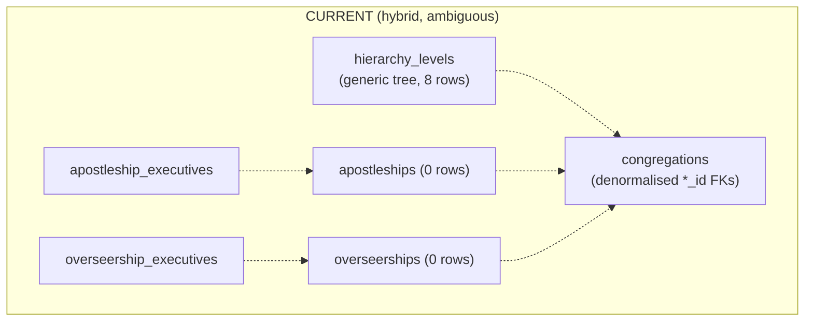
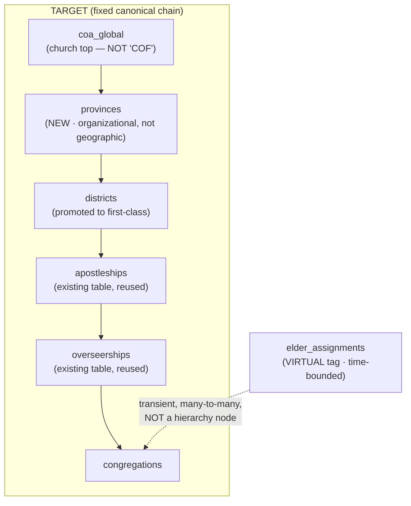
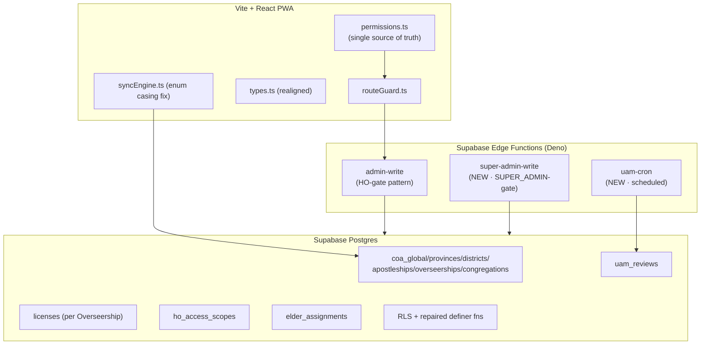
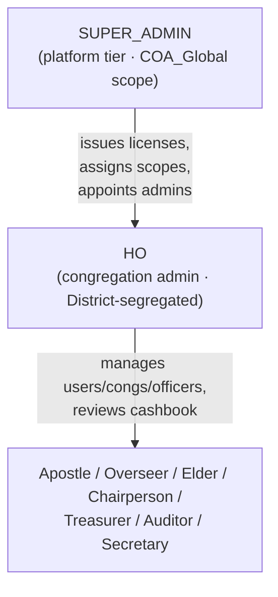
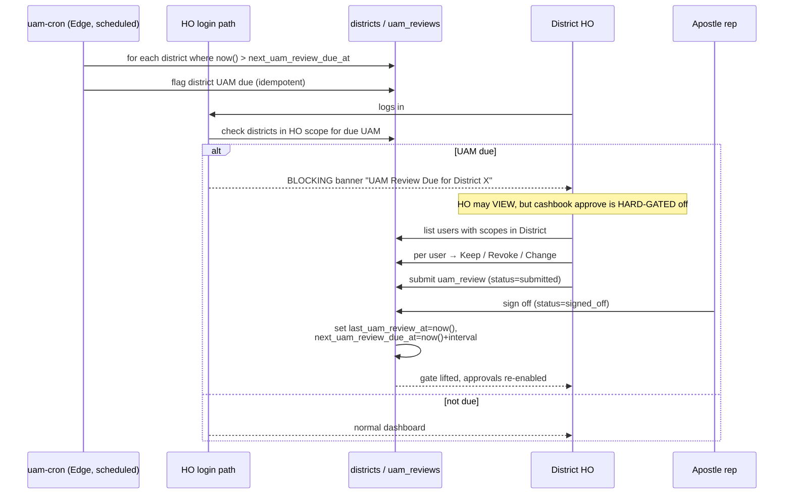
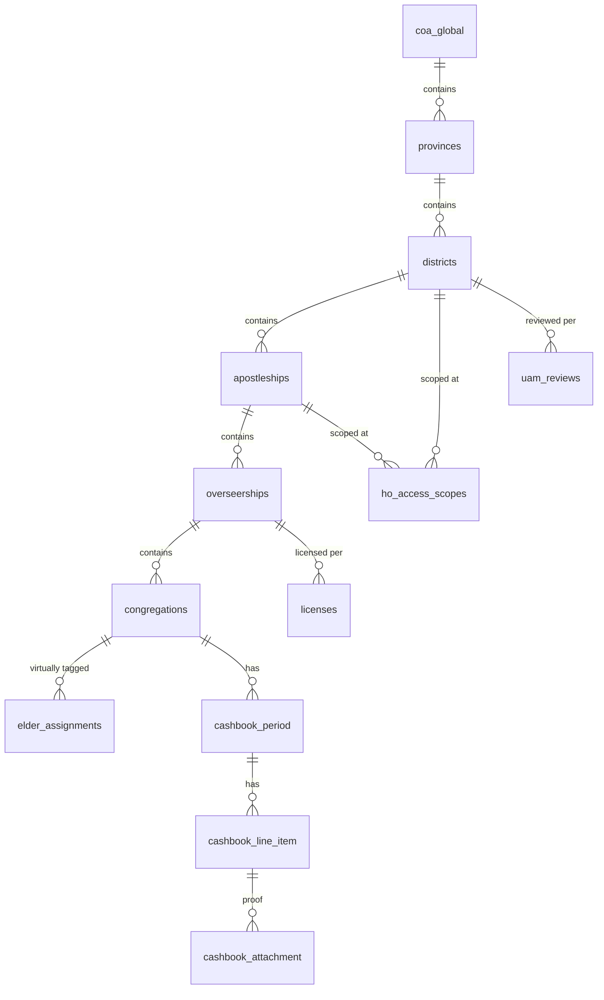
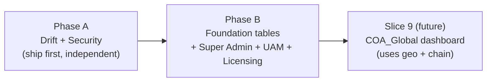

# Design Document: Foundation Slice 7e — Hierarchy, Licensing, UAM & Drift/Security Reconciliation

> **Status:** DESIGN ONLY — awaiting stakeholder sign-off. Nothing in this document is
> executed, migrated, or applied. All DDL/SQL is illustrative of intent, not a runbook.
> **Grounded on:** `docs/drift-report.md` (read-only audit of live prod project
> `cwdyixafvylzgtpsfmwr`, pre-launch, test data only). That report — NOT the stale
> `src/lib/types.ts` / `src/db/schema.ts` assumptions — is the authoritative description
> of the current database.
> **Pre-launch note:** The live DB holds test data only (2 congregations, 10 officers,
> 10 user_hierarchy_access rows, 10 cashbook_period, 64 cashbook_line_item, 8
> hierarchy_levels). This permits structural change, but data-preserving steps for those
> existing rows are called out explicitly where relevant.

---

## Overview

Foundation Slice 7e establishes the organisational, licensing, and governance backbone
the OAC Cashbook needs before go-live, and reconciles it with the **real** database as
captured by the drift audit. It is organised into two cleanly separable phases:

- **Phase A — Drift & Security Hardening (ship-first, foundation-independent).** Correct
  the type-layer fiction in `src/lib/types.ts`, fix the `syncEngine.ts` proof-status enum
  casing, repair the two broken `SECURITY DEFINER` functions, close the wide-open cashbook
  RLS hole, add RLS policies to the fully-locked census tables, lock down anonymous
  `EXECUTE` and `search_path` on definer functions, add the 26 missing FK covering
  indexes, drop duplicate/unused indexes, and enable leaked-password protection. Phase A
  is safe to deploy on its own and makes the current database behave the way the code and
  docs already assume it does.

- **Phase B — Foundation Structure (builds on Phase A).** Reconcile the hybrid hierarchy
  (generic `hierarchy_levels` tree + dedicated `apostleships`/`overseerships` tables +
  `*_executives`) into one fixed, canonical chain: **COA_Global → Province → District →
  Apostleship → Overseership → Congregation**. Introduce `provinces`, promote District to
  a first-class table, model **virtual** eldership via time-bounded `elder_assignments`,
  add built-in **licensing per Overseership**, per-District/Apostleship `ho_access_scopes`,
  an **automated UAM** review mechanism parameterised per District with a hard
  approve-gate, a new **Super Admin** tier above HO, and the geo columns
  (`address`/`country`/`continent`) that seed the future COA_Global dashboard (Slice 9).

The guiding principle: **the database is the authority (RLS + definer functions); the
client permission matrix mirrors it.** Phase A re-establishes that truth; Phase B extends
it without weakening the non-negotiable invariants (permission gate as single source of
truth, HO-is-the-only-admin, time-bounded access, fail-closed auth, directional status
flow, audited overrides).

### Verification gate (applies to every code/type change in this spec)

Any TypeScript/code change MUST keep:

- `tsc --noEmit` → **PASS**
- `vite build` → **PASS**
- **No change** to the Dexie Local_Store structure (`src/db/schema.ts` stores/versioning)
  or to Sync_Engine behaviour/semantics. The only permitted sync change is a literal
  string-value correction (`"uploaded"` → a valid enum value) that does not alter control
  flow, retry/backoff, conflict detection, or the local store shape.

---

# PART 1 — HIGH-LEVEL DESIGN

## Architecture

### Current (as-audited) vs Target hierarchy

The audit found a **three-way hybrid** for structure: a generic self-referential
`hierarchy_levels` tree (8 rows), dedicated `apostleships`/`overseerships` tables (0 rows
each), and `apostleship_executives`/`overseership_executives` assignment tables. Plus
congregations carry denormalised `district_id`, `apostleship_id`, `overseership_id`,
`eldership_id`. This ambiguity is exactly what the broken `get_my_hierarchy_ids()`
(references a non-existent `hierarchy` table) stumbles on.





**Reconciliation decision (justified):** Promote the chain to **dedicated typed tables**
and **retire `hierarchy_levels` as the structural source of truth**.

- *Why not keep the generic tree?* The business structure is fixed and will not add
  arbitrary levels; a generic self-referential tree buys flexibility the domain does not
  want and costs correctness (it is the direct cause of the broken definer function and
  the wrong traversal direction). Typed tables give FK integrity, clear parent-type rules,
  and indexable joins.
- *Why reuse `apostleships`/`overseerships`?* They already exist (0 rows → nothing to
  migrate) and already match two target levels. We keep them, add the missing
  `provinces`/`districts` tables above, and point congregations' denormalised columns at
  the new canonical rows.
- *`hierarchy_levels` fate:* Retain the table short-term as a **read-only compatibility
  shim** (not written by new code) only if any Phase-A query still references it; the
  Phase-B exit criterion is that no code path reads it. The 8 test rows are reproducible,
  so this is a convenience, not a data-preservation requirement.
- *`*_executives` tables:* Keep as **assignment/contact** tables hanging off
  apostleship/overseership (exec name, email, mobile, is_active). They are not structural
  nodes and do not participate in the chain; they feed the licensing "issued_by" and UAM
  "Apostle rep sign-off" flows.

### Eldership is virtual (not a node)

Eldership is deliberately **absent** from the chain. An Elder looks after one or more
congregations, which can change month to month (illness cover, reassignment). Modelling it
as a hierarchy node would force structural churn every month. Instead `elder_assignments`
is a **time-bounded tag** linking a user (Elder) to a congregation for a date window. The
existing `congregations.eldership_id` column is demoted to a denormalised convenience/no-op
and is not the authority; `elder_assignments` is.

### System context (where the new pieces live)



## Permission model: introducing SUPER_ADMIN without breaking "HO is the only admin"

The steering invariant "**HO is the only admin** (`M`)" governs *congregation-domain*
administration: users, congregations, officers, hierarchy management, bulk import, audit
logs. Super Admin is a **new platform-operator tier above HO** that owns *platform*
concerns HO must never touch: **issuing/renewing licenses, assigning HO access scopes,
and appointing other Super Admins**. These are new permission modules that are `-` for HO.

Decision: add `SUPER_ADMIN` as a new `Role` and a new column of the permission matrix. The
existing `admin.*` (`M`) rows stay **HO-only** — Super Admin does **not** get `M` on them,
so "HO is the only admin" for the congregation domain is preserved verbatim. Super Admin
instead gets `M` on brand-new `platform.*` modules that HO has `-` on. The two admin
surfaces are disjoint.

| Module (new) | SUPER_ADMIN | HO | all others |
|---|---|---|---|
| `platform.manage_licenses` | `M` | `-` | `-` |
| `platform.manage_access_scopes` | `M` | `-` | `-` |
| `platform.manage_super_admins` | `M` | `-` | `-` |
| `platform.manage_provinces` | `M` | `-` | `-` |
| `platform.manage_districts` | `M` | `-` | `-` |
| `uam.review_submit` (District HO performs) | `-` | `A` | `-` |
| `uam.review_signoff` (Apostle rep) | `-` | `-` | Apostle `A` |

Super Admin is **assignable, not a hardcoded email** (the audit flagged hardcoded-identity
risk). Assignment is a row in `user_hierarchy_access` with `role = 'SUPER_ADMIN'` and
`scope_level = 'COA_Global'`, supporting multiple colleagues. All platform writes go
through a new `super-admin-write` Edge Function that reproduces the `admin-write` gate with
the role check set to `SUPER_ADMIN`.



## UAM (automated access review) — behavioural model

UAM is the lowest-form governance control at **District** level, parameterised per
District. Each District carries `uam_frequency_months` (3 = quarterly, 6 = bi-annual),
`last_uam_review_at`, and `next_uam_review_due_at`.



**Hard gate semantics:** while a District in the HO's scope has an open/overdue UAM,
`ho.review` and `month.*` approve/submit actions for congregations in that District are
denied at **both** the permission layer (a UAM predicate wraps the approve checks) and the
RLS/definer layer (fail-closed). HO can still read everything. The gate lifts only when the
review reaches `signed_off` and the District's due-date is advanced.

## Licensing — behavioural model

Licensing is **built-in**, priced **per Overseership** (the lowest HO performance
indicator = congregational performance rolled up at Overseer level). It is administered at
**District/Apostleship** level, **not** Province.

- A `licenses` row is **per overseership**, with `status ∈ {Active, Expired, Suspended}`,
  `max_ho_users`, `term_start`/`term_end`, `renewal_due_at`, `auto_renew`, `issued_by`
  (Super Admin user id).
- HO sees a **warning banner 30 days before** `term_end`/`renewal_due_at`.
- An `Expired`/`Suspended` license fail-closes HO write/approve capability for that
  Overseership's congregations (view may remain, consistent with the UAM gate pattern).
- Only Super Admin issues/renews (via `super-admin-write`); HO cannot self-license.

## COA_Global dashboard foundation (Slice 9 — data only here)

Slice 9 (future) is the annual apostles-conference consolidated view: provincial
contributions, membership, officer counts, and a geographic map. This spec lays **only the
data foundation**:

- Add `congregations.address`, `congregations.country`, `congregations.continent`
  (currently only `gps_location` lng/lat exists). These make the geo map and
  continent/country filtering possible.
- The fixed chain + province rollup makes "provincial contributions" a straightforward
  aggregate over `cashbook_period`/`cashbook_line_item` joined up the typed chain.
- No dashboard UI, views, or aggregates are built in this slice beyond what Phase A already
  corrects.

## Components and Interfaces

### Realigned `src/lib/types.ts` (Phase A)

**Purpose:** stop lying about the schema. Drop the fictional `CashbookService`; make
`ServiceStatus` the real 7-value enum; fix `PROOF_STATUSES`; correct `CashbookLineItem`.

```typescript
// REAL period status (cashbook_period.status) — 7 values, replaces the fictional 9.
export const SERVICE_STATUSES = [
  "Draft",
  "Submitted",
  "AuditApproved",
  "SubmittedToOverseer",
  "Rejected",
  "SubmittedToHO",
  "HOReviewed",
] as const;
export type ServiceStatus = (typeof SERVICE_STATUSES)[number];

// REAL proof status (3 values) — "Uploaded" removed.
export const PROOF_STATUSES = ["Pending", "Deposited", "NA"] as const;
export type ProofStatus = (typeof PROOF_STATUSES)[number];

// REAL cashbook_line_item shape — no income_type / proof_image_url / service_id.
export interface CashbookLineItem {
  id: string;
  period_id: string;            // FK -> cashbook_period.id (NOT service_id)
  section: LineSection;
  officer_id: string | null;
  is_officer: boolean;
  item_type: string;           // EFT | DirectDebit | Cash | CashPending | CashBanked | Burial | Expense
  item_count: number | null;
  amount: number;
  payment_type: string | null;
  manual_reference: string | null;
  receipt_number: string | null;
  transaction_date: string | null;
  proof_status: ProofStatus | null;
  proof_reference: string | null;
  approved: boolean | null;
}
// DELETE: the entire CashbookService interface (service_type/service_date/locked_at/
// service_id/income_type/proof_image_url do NOT exist). Reporting code should move to a
// cashbook_period-based type (see Low-Level Design).
```

> **New enum member note:** adding `SUPER_ADMIN` to `ROLES` requires the permission matrix
> in `permissions.ts` to supply a column for it on every module key (TypeScript's
> `Record<Role, PermCode>` makes any omission a compile error — this is the `tsc --noEmit`
> gate doing its job). The Low-Level Design lists the exact matrix additions.

### `src/utils/syncEngine.ts` enum casing fix (Phase A)

**Purpose:** the engine writes `proof_status: "uploaded"` (lowercase, not a valid enum
member) which throws on sync. Fix the **literal value only** — no structural or behavioural
change — to a valid `proof_status` enum member.

```typescript
// BEFORE (invalid): .update({ proof_status: "uploaded" })
// AFTER  (valid):   .update({ proof_status: "Deposited" })   // real enum: Pending|Deposited|NA
// Applies to the three write sites in syncLineItem()/syncDepositSlip() and the mirrored
// local db.lineItems.update(...) calls. Dexie store shape, retry/backoff, conflict
// detection, and ordering are UNCHANGED.
```

> Rationale for `Deposited`: proof upload during sync represents banked/attached proof;
> `Deposited` is the real terminal proof state. (Stakeholders confirm during review if a
> different member — e.g. a new `Attached` value — is preferred; that would be an enum DDL
> change, not just a client fix.)

### Repaired definer functions (interface view)

```
get_my_role() -> text
  Reads the caller's active role from user_hierarchy_access (NOT user_profiles).
get_my_hierarchy_ids() -> setof uuid
  Returns the congregation ids the caller may access, traversing the REAL typed chain
  in the correct direction (caller scope -> descendant congregations).
```

## Data Models



**Validation rules (chain):**
- `provinces.coa_global_id` required (single COA_Global root).
- `districts.province_id` required.
- `apostleships.district_id` required.
- `overseerships.apostleship_id` required.
- `congregations.overseership_id` required; denormalised `district_id`/`apostleship_id`
  must agree with the chain, enforced by a BEFORE INSERT OR UPDATE database trigger on
  `congregations` (Req 11.6) — not at the app-layer; see Low-Level Design.
- `elder_assignments`: `(elder_user_id, congregation_id, start_date)` time-bounded; may
  overlap congregations (an Elder covers several) but is validated `end_date >= start_date`.
- `licenses`: unique active license per `overseership_id`; `term_end > term_start`.

## Error Handling

| Scenario | Condition | Response | Recovery |
|---|---|---|---|
| License expired | HO approve on a congregation whose Overseership license is Expired/Suspended | Deny approve (fail-closed), show license banner | Super Admin renews → status Active |
| UAM overdue | `now() > next_uam_review_due_at` for a District in HO scope | Blocking banner; approvals hard-gated; view allowed | Complete review → Apostle sign-off → due-date advanced |
| Enum write mismatch (pre-fix) | Writing `PendingAudit`/`uploaded` etc. | Postgres enum error (latent today) | Phase A type + sync fixes remove the mismatch |
| RLS wide-open (pre-fix) | Any authenticated user reads any congregation | Confidentiality hole | Phase A removes blanket `USING(true)` policies |
| Census locked (pre-fix) | RLS enabled, 0 policies | No API read/write possible | Phase A adds scoped policies |
| Super Admin missing | No `SUPER_ADMIN` row assigned | Platform writes impossible (fail-closed) | Assign at least one Super Admin (bootstrap step) |

## Testing Strategy

- **Unit:** permission matrix (every module key has a `SUPER_ADMIN` column; HO still `-`
  on `platform.*`; HO still `M` on `admin.*`); UAM due-date math; license-expiry window
  (30-day warning boundary); chain parent-type validators.
- **Property-based (recommend fast-check):**
  - UAM: for any `last_uam_review_at` and `uam_frequency_months ∈ {3,6}`,
    `next_uam_review_due_at = last + months`, and the gate is on **iff** `now > due`.
  - Licensing: warning shown **iff** `0 ≤ term_end − now ≤ 30 days`; approve allowed
    **iff** `status = Active ∧ now ≤ term_end`.
  - Chain integrity: no congregation resolves to two different provinces up the chain.
- **Integration (post-sign-off, against a branch DB):** RLS positive/negative — a user in
  District A cannot read District B after the blanket policy removal; census read/write
  works for scoped roles; definer functions return correct congregation sets.
- **Verification gate:** `tsc --noEmit` and `vite build` after the Phase-A client changes,
  with no Dexie/sync behavioural diff.

## Security Considerations

- Reproduce the `admin-write` gate exactly in `super-admin-write` and `uam-cron`
  (service-role present `500` → Bearer `401` → `getUser` `401` → active role `403` →
  validate body `400` → write). Never expose the service-role key client-side.
- All definer functions move to pinned `search_path` and lose `anon` EXECUTE.
- Leaked-password protection enabled in Auth settings.
- Fail-closed everywhere: license/UAM/scope checks default to deny on any error.

## Dependencies

- Supabase (Postgres, Auth, Edge Functions, scheduled functions for `uam-cron`).
- No new client libraries required for Phase A/B foundation. (Slice 9 map lib is out of
  scope.)

---

# PART 2 — LOW-LEVEL DESIGN (DDL / SQL / function rewrites)

> All SQL below is **illustrative design intent**, not an execution runbook. Final
> column types, constraint names, and index choices are confirmed at sign-off. Grounded on
> the real column lists in `docs/drift-report.md` and `docs/supabase_dump.md`.

## Phase A — Drift & Security Hardening

### A1. Repair `get_my_role()` (reads from `user_hierarchy_access`)

```sql
-- BEFORE: referenced public.user_profiles (DOES NOT EXIST) -> throws.
-- AFTER: read the caller's active, in-window role from user_hierarchy_access, selecting
--        the HIGHEST-PRIVILEGE role first (Req 4.5) with start_date desc as the tiebreaker
--        among equal-rank rows (Req 4.6). plpgsql (not plain SQL) so the body can RAISE
--        the anon hard-block (Req 8.5).
-- Two-layer anon block: REVOKE EXECUTE FROM anon (see A5) + the in-body auth.role() guard
-- below (defense-in-depth — neither layer alone is relied upon).
create or replace function public.get_my_role()
returns text
language plpgsql
stable
security definer
set search_path = ''            -- pin search_path (advisor WARN)
as $$
declare
  v_role text;
begin
  -- In-body anon hard-block (Req 8.5): permission-denied, not a null/safe return.
  if auth.role() = 'anon' then
    raise exception 'permission denied' using errcode = '42501';
  end if;

  select uha.role
  into v_role
  from public.user_hierarchy_access uha
  where uha.user_id = (select auth.uid())
    and uha.status = 'active'
    and uha.start_date <= now()
    and (uha.end_date is null or uha.end_date >= now())
  -- Highest privilege rank first (Req 4.5); start_date desc only as the tiebreaker
  -- among equal-rank rows (Req 4.6). Returns null when no active in-window row (Req 4.3/4.4).
  order by
    (case uha.role
       when 'SUPER_ADMIN' then 9
       when 'HO'          then 8
       when 'Apostle'     then 7
       when 'Overseer'    then 6
       when 'Elder'       then 5
       when 'Chairperson' then 4
       when 'Treasurer'   then 3
       when 'Auditor'     then 2
       when 'Secretary'   then 1
       else 0
     end) desc,
    uha.start_date desc
  limit 1;

  return v_role;   -- null when none (fail-closed)
end;
$$;
```

### A2. Repair `get_my_hierarchy_ids()` (real tables, correct direction)

```sql
-- BEFORE: referenced public.hierarchy (DOES NOT EXIST) and walked descendants of the
--         caller node (wrong direction for "my congregation ids").
-- AFTER: resolve the caller's scope, then return the CONGREGATION ids at/under that scope
--        using the real typed chain + denormalised congregation FKs.
create or replace function public.get_my_hierarchy_ids()
returns setof uuid
language sql
stable
security definer
set search_path = ''
as $$
  with me as (
    select uha.role, uha.scope_level, uha.hierarchy_id, uha.congregation_id
    from public.user_hierarchy_access uha
    where uha.user_id = (select auth.uid())
      and uha.status = 'active'
      and uha.start_date <= now()
      and (uha.end_date is null or uha.end_date >= now())
  )
  -- Direct congregation scope
  select c.id from public.congregations c, me
    where me.congregation_id is not null and c.id = me.congregation_id
  union
  -- Overseership scope -> its congregations
  select c.id from public.congregations c, me
    where me.scope_level = 'Overseership' and c.overseership_id = me.hierarchy_id
  union
  -- Apostleship scope -> congregations under it
  select c.id from public.congregations c, me
    where me.scope_level = 'Apostleship' and c.apostleship_id = me.hierarchy_id
  union
  -- District scope (incl. HO district segregation) -> congregations in district
  select c.id from public.congregations c, me
    where me.scope_level = 'District' and c.district_id = me.hierarchy_id
  union
  -- HO explicit district assignments
  select c.id
    from public.congregations c
    join public.ho_district_assignments hda on hda.district_id = c.district_id
    where hda.user_id = (select auth.uid());
$$;
-- NOTE (design decision for sign-off): once Phase B promotes districts/apostleships to
-- typed tables, hierarchy_id references resolve against those tables; the traversal above
-- stays valid because it keys off congregations' denormalised *_id columns.
--
-- PHASE B NOTE (Req 15): the "HO explicit district assignments" branch above is swapped
-- from public.ho_district_assignments to public.ho_access_scopes, because ho_access_scopes
-- SUPERSEDES ho_district_assignments (see B5). Phase A keeps referencing
-- ho_district_assignments (still present in Phase A); the swap lands as part of the Phase B
-- migration once the rows have been copied into ho_access_scopes.
```

> **Applied (Phase A, migration `repair_get_my_hierarchy_ids_downward_traversal`):** the live
> `scope_level` values are `Congregation`, `District`, and `Eldership` (no `Overseership` /
> `Apostleship` rows yet). The applied function adds a **transitional `Eldership`** branch keyed
> on `congregations.eldership_id` so Phase-A Elder users resolve their congregations; this branch
> is removed in Phase B (Task 12 / B3) when eldership becomes virtual via `elder_assignments`
> (Req 13). The Overseership/Apostleship branches are retained as forward-looking no-ops.

### A3. Close the cashbook RLS hole

```sql
-- Problem (drift §3): blanket permissive policies on both tables:
--   USING (true) WITH CHECK (true) for role authenticated  -> OR'd with role policies
--   => any authenticated user can CRUD every congregation's data.
-- Fix: DROP the blanket policies so the role/scope policies become the real gate.
drop policy if exists "Auth all periods"    on public.cashbook_period;
drop policy if exists "Auth all line items" on public.cashbook_line_item;

-- Replace with scope-gated policies built on the repaired definer fn.
create policy cashbook_period_select on public.cashbook_period
  for select to authenticated
  using ( congregation_id in (select public.get_my_hierarchy_ids()) );

create policy cashbook_period_write on public.cashbook_period
  for all to authenticated
  using ( congregation_id in (select public.get_my_hierarchy_ids()) )
  with check ( congregation_id in (select public.get_my_hierarchy_ids()) );

create policy cashbook_line_item_select on public.cashbook_line_item
  for select to authenticated
  using ( exists (
    select 1 from public.cashbook_period p
    where p.id = cashbook_line_item.period_id
      and p.congregation_id in (select public.get_my_hierarchy_ids())
  ));
-- (write policy mirrors select; wrap auth.*() as (select auth.uid()) per advisor §6)
```

> **Design note:** the detailed per-role verbs (treasurer writes Draft, auditor approves,
> secretary totals-only) remain enforced in `permissions.ts`; RLS enforces *scope* (which
> congregations) as the authoritative backstop. Keeping role-verb logic in the matrix and
> scope in RLS avoids duplicating the full matrix in SQL while still fail-closing.

> **Applied (Phase A, Oct 5 — via Supabase SQL editor, not `apply_migration`):** in addition to
> the two blanket policies, the **six per-role policies** (`treasurer write period`, `auditor
> update`, `elder submit`, `secretary read period`, `treasurer write line`, `secretary read
> line`) were dropped as part of closing the hole — the generic scope-gated write policy
> OR-supersedes them and per-role verbs now live in `permissions.ts` (Req 6.5). Final live state:
> four scope-gated policies (`cashbook_period_select/_write`, `cashbook_line_item_select/_write`),
> RLS still enabled on both tables. Because the destructive-statement confirmation would not
> surface in this environment, the drops+creates ran in the SQL editor, so this change has **no
> entry in Supabase migration history** — to be reconciled separately if clean history is required.

### A4. Census RLS policies (tables currently locked: RLS on, 0 policies)

```sql
-- Decision: ADD scoped policies (do NOT disable RLS — member data is sensitive).
create policy priest_census_select on public.priest_census
  for select to authenticated
  using ( congregation_id in (select public.get_my_hierarchy_ids()) );

create policy priest_census_write on public.priest_census
  for all to authenticated
  using ( congregation_id in (select public.get_my_hierarchy_ids()) )
  with check ( congregation_id in (select public.get_my_hierarchy_ids()) );

-- Log table has no congregation_id; gate via its parent census row.
create policy priest_census_log_select on public.priest_census_log
  for select to authenticated
  using ( exists (
    select 1 from public.priest_census pc
    where pc.id = priest_census_log.priest_census_id
      and pc.congregation_id in (select public.get_my_hierarchy_ids())
  ));
-- (Totals-only / line-item hiding for Secretary stays a UI concern per isTotalsOnly.)
```

> **Applied (Phase A, Oct 5, migration `census_rls_scoped_policies_append_only_log`):** `priest_census`
> got scoped `SELECT` + `ALL` (write); `priest_census_log` got scoped `SELECT` + **`INSERT`-only**
> (append-only audit per Req 7.3 — no `UPDATE`/`DELETE`), since no trigger or `SECURITY DEFINER`
> function writes the log (the app inserts it directly as the authenticated user, so an INSERT
> policy is required). RLS remains enabled on both tables.

### A5. Lock down SECURITY DEFINER functions

```sql
-- Revoke anonymous execute on all four definer functions (advisor WARN: anon can call
-- get_or_create_period and create Draft periods unauthenticated).
revoke execute on function public.get_or_create_period(uuid, text, text, uuid) from anon;
revoke execute on function public.can_capture_period(uuid)                     from anon;
revoke execute on function public.get_my_role()                                from anon;
revoke execute on function public.get_my_hierarchy_ids()                       from anon;

-- Pin search_path on the two we are not already rewriting (A1/A2 already set it).
alter function public.get_or_create_period(uuid, text, text, uuid) set search_path = '';
alter function public.can_capture_period(uuid)                     set search_path = '';
-- Keep SECURITY DEFINER (they must see across rows) but ensure the body re-checks the
-- caller's scope via get_my_hierarchy_ids() so DEFINER cannot be abused post-authn.
--
-- TWO-LAYER anon block for get_my_role() (Req 8.5): the anon hard-block is BOTH the
-- `revoke execute ... from anon` above AND the in-body `auth.role() = 'anon'`
-- permission-denied guard shown in A1. The REVOKE blocks the call at the grant layer; the
-- in-body guard raises permission-denied (never a null/safe return) if an anon caller still
-- reaches the body — defense-in-depth, neither layer relied upon alone.
```

> **Applied (Phase A, Oct 5, migration `harden_definer_functions_revoke_public_scope_recheck`):**
> corrected two things vs the sketch above — (1) EXECUTE was revoked from **`PUBLIC`** (not `anon`;
> the grant is held via the PUBLIC default, so revoking `anon` alone would have been a no-op) and
> re-granted to `authenticated`, `service_role`; (2) `can_capture_period`'s real signature is
> `(uuid, integer, integer, integer, text)`. Both `get_or_create_period` and `can_capture_period`
> were rewritten to pin `search_path = ''` **and** add the Req-8.4 caller-scope re-check
> (`congregation ∈ get_my_hierarchy_ids()`), with `service_role` bypassing the check. Verified:
> `anon` EXECUTE = false, `authenticated`/`service_role` = true, `search_path` pinned on all four.

### A6. Covering indexes for the 26 unindexed FKs; drop duplicate/unused

```sql
-- Add a covering index for every FK column (illustrative subset; all 26 enumerated at
-- sign-off from the linter output).
create index if not exists idx_cli_period_id        on public.cashbook_line_item(period_id);
create index if not exists idx_cli_officer_id        on public.cashbook_line_item(officer_id);
create index if not exists idx_catt_line_item_id     on public.cashbook_attachment(line_item_id);
create index if not exists idx_cong_overseership_id  on public.congregations(overseership_id);
create index if not exists idx_cong_apostleship_id   on public.congregations(apostleship_id);
create index if not exists idx_cong_district_id      on public.congregations(district_id);
create index if not exists idx_uha_user_id           on public.user_hierarchy_access(user_id);
create index if not exists idx_hda_district_id       on public.ho_district_assignments(district_id);
-- ... (remaining FKs likewise)

-- Drop the duplicate officers index (drift §6): the two are functionally identical.
drop index if exists public.idx_officer_code_cong;      -- dup of officers_congregation_id_officer_code_key

-- Drop the 8 unused indexes — JUSTIFICATION REQUIRED per index at sign-off. Since the DB
-- is pre-launch with test data, "unused" reflects no real query history yet; we DEFER
-- dropping any index that a Phase-B query (chain joins, license lookups, UAM scans) will
-- need. Net: drop only indexes with no planned reader AND zero scans. (Enumerate at
-- sign-off; do not blind-drop.)
```

> **Deliberate caution:** the "8 unused indexes" finding is from a pre-launch DB with no
> real traffic, so "unused" is weak evidence. The design position is to **drop only the
> confirmed duplicate now** and re-evaluate the other 8 against Phase-B query plans rather
> than remove indexes a new reader will immediately want.

> **Applied (Phase A, Oct 5):** 26 covering indexes created via migration
> `add_covering_indexes_for_unindexed_fks` (named `idx_<table>_<column>`). The confirmed duplicate
> `idx_officer_code_cong` was dropped via the Supabase SQL editor (the `DROP` could not go through
> `apply_migration` because the destructive-statement confirmation would not surface — so the drop
> has **no migration-history entry**, like Task 3). Advisor `duplicate_index` finding cleared. The
> 26 new indexes now report as 'unused' (expected pre-launch; no query history) and are **retained**
> with the original 8 per Req 9.3.

### A7. Enable leaked-password protection

Auth setting (dashboard/config, not SQL): enable **leaked password protection** (HaveIBeen
Pwned check) in Supabase Auth. Documented here as a required Phase-A step; applied via
project config at sign-off.

> **Status (Oct 5): BLOCKED — requires Supabase Pro plan.** Leaked-password protection is a
> paid-tier Auth feature, not available on the project's current Free tier. It will be enabled on
> Pro post-award; documented as a known limitation per Supabase pricing (infrastructure, not code).
> The advisor `auth_leaked_password_protection` WARN remains until then.

### A8. Client type/sync changes (Phase A code)

- `src/lib/types.ts`: as PART 1 — delete `CashbookService`; realign `ServiceStatus` (7),
  `PROOF_STATUSES` (3), `CashbookLineItem`. Introduce a real `CashbookPeriod` interface to
  replace reporting references to the deleted type:

```typescript
export interface CashbookPeriod {
  id: string;
  congregation_id: string;
  year: number;
  month: number;
  week: number;
  service: string;              // "AM" | "PM" (stored as text)
  status: ServiceStatus;        // real 7-value enum
  submitted_by: string | null;
  submitted_at: string | null;
  audit_comment: string | null;
  requestor_comment: string | null;
  elder_approval_comment: string | null;
  expenses_total: number | null;
  created_at: string | null;
}
```

- `src/utils/syncEngine.ts`: literal `"uploaded"` → `"Deposited"` at the three write sites
  (and the mirrored local update). No other change. `PeriodStatus` in `src/db/schema.ts`
  is **left untouched** to honour the "no Dexie structural change" gate; any realignment of
  that local enum is explicitly out of scope for this spec.

> **Verification gate restated:** after A8, `tsc --noEmit` PASS, `vite build` PASS, Dexie
> store + sync behaviour unchanged.

## Phase B — Foundation Structure

### B1. New role + permission matrix additions

```typescript
// src/lib/types.ts
export const ROLES = [
  "SUPER_ADMIN",   // NEW platform tier (above HO)
  "HO","Apostle","Overseer","Elder","Chairperson","Treasurer","Auditor","Secretary",
] as const;
```

```typescript
// src/lib/permissions.ts — every existing module key gains a SUPER_ADMIN column
// (value "-" unless a platform concern). NEW modules added:
"platform.manage_licenses":      { SUPER_ADMIN:"M", HO:"-", Apostle:"-", Overseer:"-", Elder:"-", Chairperson:"-", Treasurer:"-", Auditor:"-", Secretary:"-" },
"platform.manage_access_scopes": { SUPER_ADMIN:"M", HO:"-", /* ... all "-" */ },
"platform.manage_super_admins":  { SUPER_ADMIN:"M", HO:"-", /* ... */ },
"platform.manage_provinces":     { SUPER_ADMIN:"M", HO:"-", /* ... */ },
"platform.manage_districts":     { SUPER_ADMIN:"M", HO:"-", /* ... */ },
"uam.review_submit":             { SUPER_ADMIN:"-", HO:"A", Apostle:"-", /* ... */ },
"uam.review_signoff":            { SUPER_ADMIN:"-", HO:"-", Apostle:"A", /* ... */ },
"license.view_warning":          { SUPER_ADMIN:"V", HO:"V", /* others "-" */ },
// NOTE: admin.* rows stay HO:"M" / SUPER_ADMIN:"-"  — "HO is the only admin" preserved.
```

> `getDashboardRoute()` gains a `SUPER_ADMIN → "/platform"` case. The route guard gains
> `canEnterPlatform(role) = hasPermission(role, "platform.manage_licenses")`.

### B2. Canonical chain tables

```sql
-- Top of the church (NOT "COF"). Single row expected.
create table public.coa_global (
  id uuid primary key default gen_random_uuid(),
  name text not null,
  created_at timestamptz not null default now()
);

-- NEW: organizational province (not geographic).
create table public.provinces (
  id uuid primary key default gen_random_uuid(),
  coa_global_id uuid not null references public.coa_global(id),
  name text not null,
  code text not null unique,
  created_at timestamptz not null default now()
);

-- District promoted to first-class (today it is only a hierarchy_levels row +
-- congregations.district_id). Carries UAM parameters (B5).
create table public.districts (
  id uuid primary key default gen_random_uuid(),
  province_id uuid not null references public.provinces(id),
  name text not null,
  code text not null unique,
  uam_frequency_months int not null default 3 check (uam_frequency_months in (3,6)),
  last_uam_review_at timestamptz,
  next_uam_review_due_at timestamptz,
  created_at timestamptz not null default now()
);

-- Existing apostleships/overseerships tables REUSED; add parent FKs to lock the chain.
alter table public.apostleships  add column if not exists district_id   uuid references public.districts(id);
alter table public.overseerships add column if not exists apostleship_id uuid references public.apostleships(id);

-- congregations: parent already overseership_id; add geo columns for Slice 9.
alter table public.congregations
  add column if not exists address   text,
  add column if not exists country   text,
  add column if not exists continent text;
-- Keep gps_location (lng/lat) as-is.

-- Chain-agreement trigger (Req 11.6): resolve the parent chain through overseership_id
-- (overseership -> apostleship -> district) and REJECT the write when the denormalised
-- district_id/apostleship_id do not agree. Enforced in the DB (not app-layer).
create or replace function public.congregations_chain_agreement()
returns trigger
language plpgsql
set search_path = ''
as $$
declare
  v_apostleship_id uuid;
  v_district_id    uuid;
begin
  -- Resolve the authoritative chain from the overseership parent.
  select o.apostleship_id, a.district_id
    into v_apostleship_id, v_district_id
  from public.overseerships o
  join public.apostleships a on a.id = o.apostleship_id
  where o.id = new.overseership_id;

  if v_apostleship_id is null or v_district_id is null then
    raise exception 'congregation chain unresolved for overseership_id=%', new.overseership_id
      using errcode = '23514';
  end if;

  -- Denormalised values must agree with the resolved chain (reject on mismatch).
  if new.apostleship_id is distinct from v_apostleship_id then
    raise exception 'apostleship_id % disagrees with chain-resolved % ',
      new.apostleship_id, v_apostleship_id using errcode = '23514';
  end if;
  if new.district_id is distinct from v_district_id then
    raise exception 'district_id % disagrees with chain-resolved %',
      new.district_id, v_district_id using errcode = '23514';
  end if;

  return new;
end;
$$;

create trigger trg_congregations_chain_agreement
  before insert or update on public.congregations
  for each row execute function public.congregations_chain_agreement();
```

**Data-preserving steps for existing test rows:** the 2 congregations keep their rows;
their denormalised `district_id`/`apostleship_id`/`overseership_id` are re-pointed to the
new typed rows (seed one `coa_global`, the required `provinces`/`districts`, and link the
existing `apostleships`/`overseerships` — both currently 0 rows, so created fresh). The 10
officers and existing cashbook rows reference congregations by id and are unaffected. No
destructive drop of `congregations`/`officers`/`cashbook_*` is proposed.

### B3. Virtual eldership

```sql
create table public.elder_assignments (
  id uuid primary key default gen_random_uuid(),
  elder_user_id uuid not null references auth.users(id),
  congregation_id uuid not null references public.congregations(id),
  start_date timestamptz not null default now(),
  end_date timestamptz,                       -- null = open-ended cover
  assigned_by uuid references auth.users(id),
  reason text,                                -- e.g. "monthly rotation", "illness cover"
  created_at timestamptz not null default now(),
  check (end_date is null or end_date >= start_date)
);
create index idx_elder_assign_elder on public.elder_assignments(elder_user_id);
create index idx_elder_assign_cong  on public.elder_assignments(congregation_id);
-- congregations.eldership_id is DEMOTED to a denormalised convenience; elder_assignments
-- is authoritative. getUserCongregationIds() may union active elder_assignments.
```

### B4. Licensing (per Overseership)

```sql
create type public.license_status as enum ('Active','Expired','Suspended');

create table public.licenses (
  id uuid primary key default gen_random_uuid(),
  overseership_id uuid not null references public.overseerships(id),
  status public.license_status not null default 'Active',
  max_ho_users int not null default 1,
  term_start timestamptz not null,
  term_end   timestamptz not null,
  renewal_due_at timestamptz,
  auto_renew boolean not null default false,
  issued_by uuid not null references auth.users(id),   -- Super Admin
  created_at timestamptz not null default now(),
  check (term_end > term_start)
);
-- One active license per overseership.
create unique index uq_license_active_per_overseership
  on public.licenses(overseership_id) where status = 'Active';
create index idx_license_overseership on public.licenses(overseership_id);

-- Warning predicate (client/view): show banner when
--   status = 'Active' AND term_end - now() <= interval '30 days' AND term_end > now()
-- Approve-gate predicate (fail-closed): allow HO approve only when a congregation's
--   overseership has an Active license with now() <= term_end.
```

> Administered at **District/Apostleship** level: the Super Admin UI lists overseerships
> grouped under their apostleship/district; Province is NOT a licensing administration
> level (it is organizational only).

### B5. `ho_access_scopes` (per District/Apostleship)

```sql
create type public.scope_grain as enum ('District','Apostleship');

create table public.ho_access_scopes (
  id uuid primary key default gen_random_uuid(),
  user_id uuid not null references auth.users(id),      -- the HO
  grain public.scope_grain not null,
  district_id    uuid references public.districts(id),
  apostleship_id uuid references public.apostleships(id),
  granted_by uuid not null references auth.users(id),   -- Super Admin
  created_at timestamptz not null default now(),
  check (
    (grain = 'District'    and district_id    is not null and apostleship_id is null) or
    (grain = 'Apostleship' and apostleship_id is not null and district_id    is null)
  )
);
create index idx_hoscope_user on public.ho_access_scopes(user_id);
-- FIRM DECISION (Req 15): ho_access_scopes SUPERSEDES ho_district_assignments. The legacy
-- table's rows become District-grain scopes here, then the legacy table is retired. The
-- migration is copy -> verify -> drop-on-success / rollback-on-failure (Req 15.3-15.6):

-- (a) Copy every ho_district_assignments row into ho_access_scopes as District-grain scopes.
insert into public.ho_access_scopes (user_id, grain, district_id, granted_by)
select hda.user_id, 'District', hda.district_id, hda.user_id   -- granted_by: provenance at sign-off
from public.ho_district_assignments hda;

-- (b) Verify the copy against the source rows before any removal (counts + set equality).
--     Pseudocode guard around the drop:
--     if (count(ho_access_scopes where grain='District')
--           matching distinct (user_id, district_id) from ho_district_assignments)
--        == count(distinct (user_id, district_id) in ho_district_assignments)
--     then  -- (c) ON SUCCESS: retire the legacy table
--        drop table public.ho_district_assignments;
--     else  -- (d) ON FAILURE: retain legacy table AND undo the partial copy
--        -- do NOT drop ho_district_assignments
--        delete from public.ho_access_scopes s
--          where s.grain = 'District'
--            and exists (select 1 from public.ho_district_assignments hda
--                        where hda.user_id = s.user_id and hda.district_id = s.district_id);
--     end if;
-- Net: on success exactly the copied scopes remain and the legacy table is gone; on failure
-- the legacy table is intact and no copied rows are left alongside it.
```

### B6. UAM reviews

```sql
create type public.uam_status as enum ('open','submitted','signed_off');
create type public.uam_decision as enum ('keep','revoke','change');

create table public.uam_reviews (
  id uuid primary key default gen_random_uuid(),
  district_id uuid not null references public.districts(id),
  period_start timestamptz not null,          -- window being reviewed
  period_due   timestamptz not null,          -- = next_uam_review_due_at at open time
  status public.uam_status not null default 'open',
  opened_at timestamptz not null default now(),
  submitted_by uuid references auth.users(id),       -- District HO
  submitted_at timestamptz,
  signed_off_by uuid references auth.users(id),       -- Apostle rep
  signed_off_at timestamptz
);

create table public.uam_review_items (
  id uuid primary key default gen_random_uuid(),
  uam_review_id uuid not null references public.uam_reviews(id) on delete cascade,
  subject_user_id uuid not null references auth.users(id),
  subject_access_id uuid references public.user_hierarchy_access(id),
  decision public.uam_decision not null,
  note text
);
create index idx_uam_reviews_district on public.uam_reviews(district_id);
create index idx_uam_items_review on public.uam_review_items(uam_review_id);

-- Due-date advance (on sign-off), parameterised by the district frequency:
-- update districts
--   set last_uam_review_at = now(),
--       next_uam_review_due_at = now() + (uam_frequency_months || ' months')::interval
-- where id = :district_id;
```

**UAM hard gate (fail-closed) — enforcement sketch:**

```sql
-- Helper: is any district in the caller's HO scope overdue/unreviewed?
create or replace function public.uam_blocked_for_me()
returns boolean language sql stable security definer set search_path = '' as $$
  select exists (
    select 1
    from public.ho_access_scopes s
    join public.districts d
      on (s.grain='District' and d.id = s.district_id)
      or (s.grain='Apostleship' and d.id in (
            select dd.id from public.districts dd
            join public.apostleships a on a.district_id = dd.id
            where a.id = s.apostleship_id))
    where s.user_id = (select auth.uid())
      and (d.next_uam_review_due_at is null or now() > d.next_uam_review_due_at)
  );
$$;
-- HO approve policies/definer paths AND the client approve checks must deny when
-- uam_blocked_for_me() is true. View remains allowed.
```

Client side: a `uam.ts` service exposes `isUamBlocked()` and the approve module checks
(`ho.review`, `month.overseer_approve`, `month.submit_to_ho`) are wrapped so a blocked HO
cannot approve, consistent with routing all checks through `permissions.ts`.

### B7. Edge Functions

```
super-admin-write (NEW)  — gate: service-role present (500) -> Bearer (401) ->
  auth.getUser (401) -> active user_hierarchy_access role = 'SUPER_ADMIN' (403) ->
  validate body (400) -> write (licenses, ho_access_scopes, provinces, districts,
  super-admin appointments) with service-role client.

uam-cron (NEW · scheduled) — idempotently flags districts where
  now() > next_uam_review_due_at (opens an 'open' uam_reviews row if none).
  Also invokable on HO login path to compute the blocking banner.
```

### B8. Super Admin bootstrap (data-preserving)

Because Super Admin is assignable (no hardcoded email), at least one `SUPER_ADMIN` row must
be seeded in `user_hierarchy_access` (`scope_level='COA_Global'`) as a one-time bootstrap
during Phase B rollout, otherwise platform writes fail-closed and no license can be issued.
This is the only identity-creation step and is called out for sign-off.

## Phasing & shipping order



- **Phase A** can deploy alone: it only corrects reality (types, sync literal, definer
  functions, RLS, indexes, auth setting). No new tables, no behavioural change to capture
  or sync. Verification gate applies.
- **Phase B** depends on A3 (scoped RLS) and A1/A2 (repaired definer fns) being in place,
  then adds the chain, licensing, scopes, UAM, Super Admin, and geo columns.
- **Slice 9** consumes Phase B's chain + geo columns; not built here.

## Correctness Properties

### Property 1: Verification gate holds

`tsc --noEmit` and `vite build` PASS after all client changes; Dexie store + sync
semantics unchanged.

**Validates: Requirements 1.1, 1.2, 1.3, 1.4, 1.5**

### Property 2: Permission matrix completeness and admin disjointness

For every permission module key, the matrix defines a value for all 9 roles (incl.
`SUPER_ADMIN`); `admin.*` is `M` for HO and `-` for SUPER_ADMIN; `platform.*` is `M`
for SUPER_ADMIN and `-` for HO.

**Validates: Requirements 17.3, 17.4, 17.5, 17.6, 19.1**

### Property 3: Cashbook scope isolation

After A3, no authenticated user can SELECT/modify a cashbook row for a congregation
outside `get_my_hierarchy_ids()`.

**Validates: Requirements 6.2, 6.3, 6.4**

### Property 4: Role resolution is fail-closed

`get_my_role()` returns a role **only** from an active, in-window `user_hierarchy_access`
row (fail-closed to null otherwise); never references a non-existent table. When multiple
active in-window rows exist it selects the highest privilege rank first, with `start_date`
descending as the tiebreaker among equal-rank rows.

**Validates: Requirements 4.1, 4.2, 4.3, 4.4, 4.5, 4.6, 20.1**

### Property 5: Definer functions locked down

No `anon` role retains EXECUTE on the four definer functions; all have pinned
`search_path`. In addition, `get_my_role()` carries an in-body `auth.role()` guard that
hard-blocks an anon caller with a permission-denied error (defense-in-depth beyond the
EXECUTE revoke).

**Validates: Requirements 8.1, 8.2, 8.3, 8.5**

### Property 6: UAM due-date and gate correctness

UAM: `next_uam_review_due_at = last_uam_review_at + uam_frequency_months`; approvals are
blocked **iff** a district in scope is overdue; view is never blocked. The gate lifts only
on Apostle-representative sign-off — submission alone keeps the gate enforced.

**Validates: Requirements 16.2, 16.3, 16.4, 16.8, 16.10**

### Property 7: Licensing approve-gate and warning window

Licensing: HO approve permitted **iff** the congregation's overseership has an Active
license with `now() ≤ term_end`; warning shown **iff** within 30 days of `term_end`. When
`now() > term_end` approve is denied immediately regardless of the stored `status` label
(no wait for a background process to set `Expired`).

**Validates: Requirements 14.4, 14.5, 14.6, 14.8**

### Property 8: Chain integrity

Chain integrity: every congregation resolves to exactly one province/district/
apostleship/overseership up the typed chain (no cross-level or orphan parents).

**Validates: Requirements 11.6, 11.7, 5.3, 5.5**

### Property 9: Eldership is virtual

Eldership never appears as a hierarchy node; Elder→congregation is expressed only via
time-bounded `elder_assignments`.

**Validates: Requirements 13.1, 13.2, 13.3**

### Property 10: Valid proof-status on sync

Every proof write during sync uses a valid `proof_status` enum member (no `"uploaded"`).

**Validates: Requirements 3.1, 3.2, 3.4**

### Property 11: Census tables scoped, not locked

Census tables are readable/writable by scoped roles (RLS policies present), not fully
locked.

**Validates: Requirements 7.1, 7.2, 7.3, 7.4**
```
