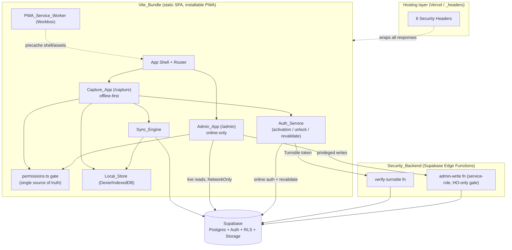
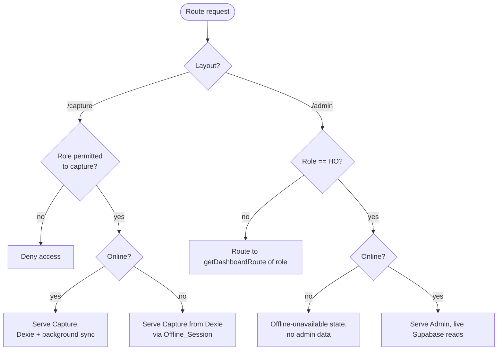
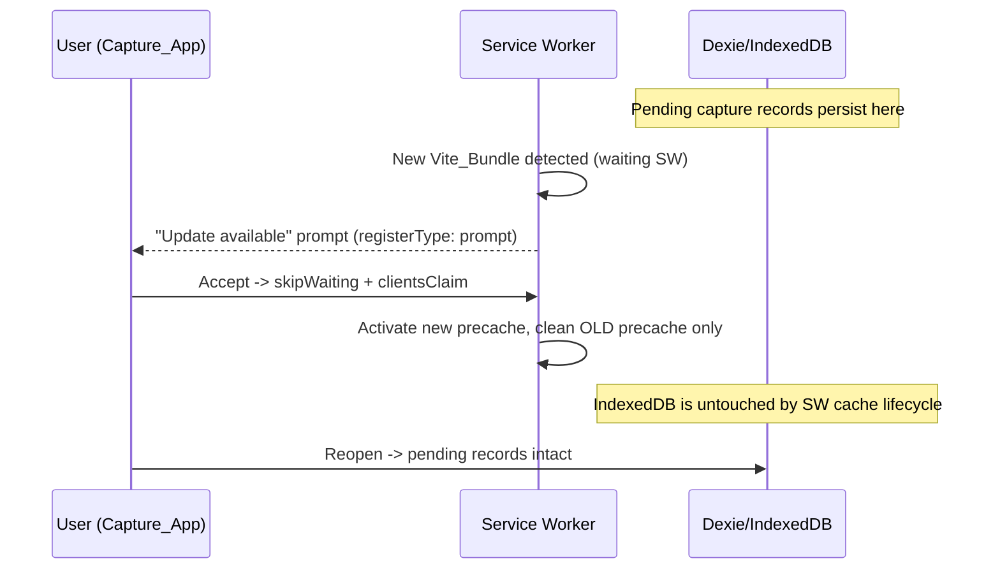
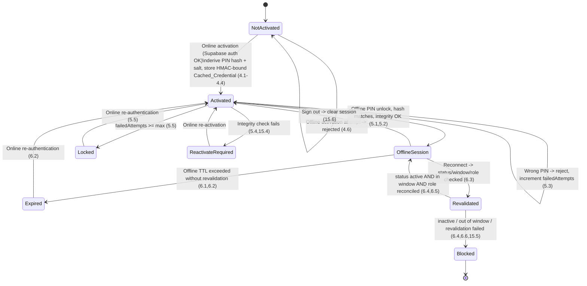
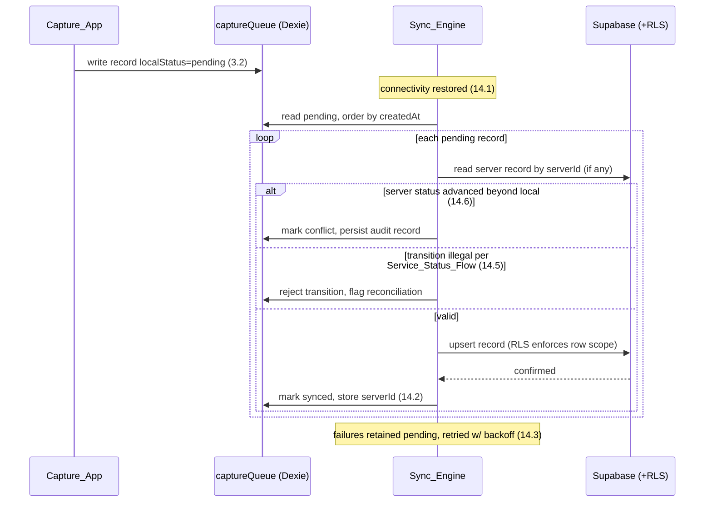

# Design Document

## Overview

This design specifies the migration of the OAC Cashbook application from a Next.js (App Router) server application to a hybrid, offline-capable single-page application built on **Vite + React + vite-plugin-pwa**. The migration is organized around the four pillars stated in the requirements:

1. A lightweight, installable, offline-capable static SPA (the **Vite_Bundle**).
2. A strict routing/environmental split between an **offline-first Capture_App** (`/capture`) and an **online-only Admin_App** (`/admin`).
3. An **offline PIN authentication** mechanism (activation → unlock → reconnect re-validation) backed by client-side cryptography.
4. Faithful preservation of every load-bearing domain, permission, security, and hierarchy invariant that currently lives in the Next.js server layer.

The central architectural challenge is that removing Next.js removes three server-side responsibilities the current invariants depend on: `middleware.ts` (route/access gating), `next.config.mjs` (security headers), and `/api/*` routes (Turnstile verification, privileged HO-only admin writes). This design relocates each responsibility to a concrete new home — a **Security_Backend** implemented as **Supabase Edge Functions** plus **host-level header configuration** — without weakening any invariant (Requirements 1.3, 7, 8, 9).

A second challenge is that storing authentication material on a device-readable IndexedDB store (Requirement 15) is inherently weaker than server-authoritative auth. This design treats the offline PIN as a **convenience gate, not an authority**: server-side RLS and mandatory reconnect re-validation remain the real authority. The design documents an explicit threat model and the compensating controls (KDF work factor, per-user salt, HMAC integrity binding, failed-attempt lockout, offline session TTL, deactivation invalidation on reconnect).

Per project steering, all preserved invariants — permission matrix as single source of truth, HO-only admin, fixed hierarchy shape and parent-type rules, HO district segregation, time-bounded fail-closed access, audited overrides, Turnstile, security headers, and Supabase RLS — carry forward unchanged (Requirements 10–13). The existing `@/lib/permissions.ts` gate and `@/lib/types.ts` canonical enums are reused verbatim.

### Research Notes and Key Findings

The following findings inform specific design decisions:

- **vite-plugin-pwa / Workbox runtime caching.** vite-plugin-pwa wraps Workbox. It supports `registerType` (`autoUpdate` vs `prompt`) and `workbox.runtimeCaching` with per-route-pattern strategies (`CacheFirst`, `StaleWhileRevalidate`, `NetworkFirst`, `NetworkOnly`). This lets us precache the app shell and apply `NetworkOnly` to Supabase requests so Admin data is never cached (Requirements 2.4, 2.5, 8 caching contract). Content was rephrased for compliance with licensing restrictions. See [vite-plugin-pwa guide](https://vite-pwa-org.netlify.app/guide/) and [Workbox strategies](https://developer.chrome.com/docs/workbox/modules/workbox-strategies/).
- **Service worker update without data loss.** The `prompt`/`autoUpdate` flow activates a new SW via `skipWaiting`/`clientsClaim`. Because unsynced records live in **IndexedDB (Dexie)** — a store that is independent of the SW asset cache — a bundle update does not touch queued records (Requirement 1.5). See [Workbox advanced recipes](https://developer.chrome.com/docs/workbox/managing-fallback-responses/).
- **WebCrypto PBKDF2 availability.** `crypto.subtle.deriveBits`/`deriveKey` with `PBKDF2` and `crypto.getRandomValues` are available in all modern browsers with no native dependency and no added bundle weight. Argon2 is memory-hard and stronger against GPU attack, but requires a WASM module (bundle cost, init latency) in the browser. See [MDN SubtleCrypto.deriveKey](https://developer.mozilla.org/en-US/docs/Web/API/SubtleCrypto/deriveKey) and [OWASP Password Storage Cheat Sheet](https://cheatsheetseries.owasp.org/cheatsheets/Password_Storage_Cheat_Sheet.html). Content was rephrased for compliance with licensing restrictions.
- **Dexie.js.** Dexie is a typed wrapper over IndexedDB supporting versioned schema declarations (`db.version(n).stores({...})`), compound and multi-entry indexes, and transactions. This maps cleanly to the reference lookup caches and the offline transaction queue. See [Dexie.js docs](https://dexie.org/docs/).
- **Supabase Edge Functions.** Deno-based serverless functions co-located with Supabase, able to read secrets (service-role key, Turnstile secret) that must never reach the client. This is the natural home for the removed `/api/*` routes. See [Supabase Edge Functions](https://supabase.com/docs/guides/functions).

---

## Architecture

### High-Level Component Map



### Environmental / Routing Split (Requirement 2)

Two route layouts are code-split at the router boundary so the Admin bundle is not needed to run Capture offline:

- `/capture/*` — **offline-first**. Reads/writes go to the Local_Store first. Operable with no network (Requirements 2.1, 2.3, 3). Accessible only to roles permitted to capture (Requirement 2.7).
- `/admin/*` — **online-only**. Reads live from Supabase, never from the Local_Store (Requirement 2.5). When offline, renders an explicit offline-unavailable state and exposes no admin data (Requirement 2.4). Accessible only to the HO role; non-HO users are routed to their `getDashboardRoute(role)` destination (Requirement 2.6).



All access decisions in both branches are computed via `permissions.ts` (`hasPermission`, `getPermission`, `isTotalsOnly`, `isOverrideAction`, `getDashboardRoute`) — never via inline role comparisons (Requirement 10.1). Because `middleware.ts` no longer exists, its first-pass gate becomes a **client-side route guard** in the SPA router that consumes the same permission gate, backed by the always-authoritative server RLS.

### Relocating the Removed Next.js Server Responsibilities (Requirement 1.3)

The **Security_Backend** is defined concretely as **Supabase Edge Functions**, and the header responsibility moves to **host-level configuration**. Mapping table:

| Old Next.js artifact | Responsibility | New home |
| --- | --- | --- |
| `middleware.ts` route/role gate | First-pass route protection, wrong-role redirect, access-window block | Client-side router guard using `permissions.ts` + Supabase RLS as the real authority (Requirements 2.6, 2.7, 12) |
| `next.config.mjs` `headers()` | 6 HTTP security headers on all responses | Host-level config: Vercel `vercel.json` `headers` **or** a static `_headers` file served by the host (Requirement 8) |
| `/api/auth/verify-turnstile` | Server-side Turnstile token verification with `remoteip` | Supabase Edge Function `verify-turnstile` (holds `TURNSTILE_SECRET_KEY`) (Requirement 7) |
| `/api/admin/*` (create/update-hierarchy, etc.) | Privileged HO-only writes via service-role key | Supabase Edge Function(s) `admin-write` (holds `SUPABASE_SERVICE_ROLE_KEY`) reproducing the full authorization gate (Requirement 9) |
| Server session/access lookup | Access-record + window enforcement | Duplicated in online auth path (Auth_Service) and Edge Function authorization path (Requirement 12.4) |

The service-role key and Turnstile secret live **only** inside Edge Functions and are never bundled into the Vite_Bundle (Requirements 9.1, 15 spirit).

### Vite + React + vite-plugin-pwa Scaffolding and Asset Caching (Requirement 1)

**Scaffolding parameters.**

- Build tool: **Vite** (`@vitejs/plugin-react`), React 18+, TypeScript. Path alias `@ -> /src` preserved so `@/lib/types`, `@/lib/permissions`, `@/lib/supabase/client` imports remain valid.
- Entry structure:
  - `index.html` → `src/main.tsx` mounts `<App/>`.
  - `src/App.tsx` hosts the router with two lazily-imported layout roots so they are separate chunks:
    - `const CaptureLayout = lazy(() => import('./capture/CaptureLayout'))`
    - `const AdminLayout = lazy(() => import('./admin/AdminLayout'))`
  - Shared, always-loaded core: router guard, `permissions.ts`, `types.ts`, Auth_Service bootstrap, Local_Store (Dexie) init.
- Code-splitting: the two layouts (and their route trees) split into distinct chunks so a field officer loading `/capture` offline never needs Admin code, and the SW can precache the Capture shell independently.

**vite-plugin-pwa configuration (conceptual).**

- `registerType: 'prompt'` — an update prompt is preferred over silent `autoUpdate` so an in-progress capture is not interrupted mid-write; the user confirms activation of a new bundle. (`autoUpdate` is acceptable if paired with the no-data-loss guarantee below.)
- `manifest`: installable PWA name, icons (reusing `public/nac-logo.png`), theme, `display: standalone`.
- `workbox.globPatterns`: precache the app shell, JS/CSS chunks, fonts, and the Capture layout chunk.

**Caching strategy per asset class:**

| Asset class | Strategy | Rationale |
| --- | --- | --- |
| App shell (`index.html`), JS/CSS chunks, fonts, icons | **Precache** (Workbox precache manifest) | Guarantees Capture_App loads offline (Requirement 1.2, 2.3) |
| Static images / logo | **CacheFirst** (with expiration) | Rarely change; safe to serve from cache |
| Reference lookup fetches used to *populate* Dexie (congregations, hierarchy) | **StaleWhileRevalidate** *(only while online; data is then persisted into Dexie)* | Fast paint, background refresh; offline reads still come from Dexie, not SW cache |
| Supabase API calls made by **Admin_App** | **NetworkOnly** — must **NOT** be cached | Admin is online-only; caching admin data would violate Requirements 2.4/2.5 |
| Supabase Auth / Edge Function calls | **NetworkOnly** | Auth and privileged writes must never be served from cache |
| Capture data | **Not served by SW at all** — read from Dexie | Offline capture reads/writes go through the Local_Store (Requirement 3) |

**Update flow without discarding unsynced records (Requirement 1.5).**



The SW lifecycle only manages the **asset precache**; the Dexie/IndexedDB database is a separate storage domain and is never cleared on bundle activation. On the next launch of the updated bundle, the Sync_Engine finds the same pending queue and resumes.

### Offline PIN Lifecycle (Requirements 4, 5, 6, 15)



### Sync Flow (Requirement 14)



---

## Components and Interfaces

All interfaces below are **design contracts**, not implementation. Type names reuse `@/lib/types.ts` where possible (`Role`, `ServiceStatus`, `SERVICE_STATUSES`, `LineSection`, `IncomeType`, etc.).

### 1. Router Guard (`routeGuard`)

Replaces the first-pass gate of `middleware.ts`.

- `resolveAccess(): Promise<UserHierarchyAccess | null>` — online: delegates to `getUserAccess()`; offline: derives role/window from the active Offline_Session's Cached_Credential (Requirement 10.6).
- `canEnterCapture(role: Role): boolean` — true if any `capture.*` module grants a non-`-` code via `hasPermission` (Requirement 2.7).
- `canEnterAdmin(role: Role): boolean` — `role === 'HO'` expressed through the matrix (`admin.*` = `M`) (Requirement 2.6).
- `redirectTargetFor(role: Role): string` — `getDashboardRoute(role)` (Requirement 2.6).

### 2. Auth_Service

Contract (crypto detail in Data Models / Threat Model):

- `activateOffline(input: { email; password; turnstileToken?; pin: string }): Promise<ActivationResult>` — online-only. Verifies Turnstile via Edge Function (Requirement 7), authenticates with Supabase, loads the active Access_Record, then derives and stores the Cached_Credential. Rejects if offline (Requirement 4.6).
- `unlockOffline(pin: string): Promise<UnlockResult>` — derives a hash of the submitted PIN with the stored salt/KDF and compares to the stored hash (Requirement 5.1); verifies HMAC integrity first (Requirements 5.4, 15.4); enforces lockout (Requirement 5.5); on success establishes an Offline_Session scoped to cached role metadata (Requirement 5.2).
- `revalidateOnReconnect(): Promise<RevalidationResult>` — re-checks Access_Record `status`, Access_Window, and server role against Supabase (Requirements 6.3–6.6); reconciles role into the Cached_Credential; invalidates the credential when the user is deactivated/revoked (Requirement 15.5); non-authorizing on any failure (Requirement 6.6).
- `enforceTTL(now: Date): SessionState` — ends the Offline_Session if the offline TTL is exceeded (Requirements 6.1, 6.2).
- `signOut(): void` — clears active Offline_Session state (Requirement 15.6).

### 3. Local_Store (Dexie) — see Data Models

- `db` — the Dexie database instance with versioned schema.
- `credentials`, `congregations`, `hierarchyLevels`, `captureQueue`, `lineItems`, `syncMeta` object stores.

### 4. Reference Cache Loader (`referenceCache`)

- `refreshLookups(): Promise<void>` — online-only; pulls `congregations` and `hierarchy_levels` from Supabase (filtered by RLS/scope) and upserts them into the Dexie lookup stores; records timestamp in `syncMeta`.
- `getCongregations(): Promise<CongregationLookup[]>` / `getHierarchy(): Promise<HierarchyLookup[]>` — offline reads from Dexie for capture pickers.

### 5. Sync_Engine

- `enqueue(record: QueuedRecord): Promise<void>` — write a pending record (Requirement 3.2).
- `syncPending(): Promise<SyncReport>` — the reconciliation algorithm (see Data Models); orders by `createdAt`, validates transitions, detects conflicts, retries with backoff (Requirements 14.1–14.6).
- `isValidTransition(from: ServiceStatus | null, to: ServiceStatus, actorRole: Role): boolean` — enforces the directional Service_Status_Flow and HO-only correction/unlock (Requirements 14.4, 14.5, 14.7).

### 6. Security_Backend (Supabase Edge Functions)

- `verify-turnstile` — accepts `{ token, remoteip }`; verifies with Cloudflare; missing token → reject; verification failure → reject; missing secret → dev bypass success (Requirements 7.1–7.6).
- `admin-write` — reproduces the privileged gate exactly: service-role key present (else 500) → bearer token (else 401) → resolve user (else 401) → active Access_Record with role `HO` (else 403) → validate body (else 400) → write with service-role client (Requirements 9.1–9.7).

### 7. Permission Gate

Reused **unchanged** from `@/lib/permissions.ts`. Offline, `resolveAccess` feeds the cached role into the same functions so the matrix stays the single source of truth (Requirements 10.1–10.6). Override actions still call `logSelfReviewException`; when offline, the override event is enqueued as an auditable Local_Store record and flushed on reconnect (Requirement 10.5).

---

## Data Models

### Cached_Credential (Requirements 4, 5, 15)

Stored in Dexie `credentials`, keyed by `userId`.

```
CachedCredential {
  userId: string            // primary key
  pinHash: string           // base64 of PBKDF2-derived bits (SHA-256)
  salt: string              // base64, per-user, crypto.getRandomValues (15.2)
  kdfIterations: number     // work factor recorded for forward compatibility (15.1)
  hmac: string              // base64 HMAC over the integrity-protected fields (4.4,15.3)
  role: Role                // cached role metadata (4.3)
  accessStartDate: string   // Access_Window start (4.3)
  accessEndDate: string|null// Access_Window end (4.3)
  activatedAt: string       // ISO timestamp
  failedAttempts: number    // consecutive offline failures (5.5)
  lockedUntil: string|null  // set when lockout triggers (5.5)
}
```

The `hmac` is computed over the canonical serialization of `{ pinHash, salt, kdfIterations, role, accessStartDate, accessEndDate, activatedAt }` (Requirement 15.3). The raw PIN is never stored (Requirement 4.5).

### Reference Lookup Caches (offline capture pickers)

`congregations` — read-only cache mirrored from Supabase `congregations` (and `Congregation` in types):

```
CongregationLookup {
  id: string               // primary key
  name: string
  code: string
  overseership_id: string|null
  eldership_id: string|null
  apostleship_id: string|null
  district_id: string|null
}
```

`hierarchyLevels` — mirrored from `hierarchy_levels` (`HierarchyNode` in types), preserving the self-referential shape and parent-type rules for offline display (Requirement 11):

```
HierarchyLookup {
  id: string               // primary key
  name: string
  code: string
  level_type: HierarchyLevel
  parent_id: string|null
}
```

Both are populated online by `referenceCache.refreshLookups()` and read offline. They are reference data only — never a source for admin decisions, and they carry no PII.

### Offline Transaction Queue

`captureQueue` — the offline transaction queue, keyed by a client-generated `localId` (UUID):

```
QueuedRecord {
  localId: string          // primary key (client UUID)
  entityType: string       // 'cashbook_service' | 'line_item' | 'banking' | 'census' | 'override_audit' ...
  payload: object          // the record body to persist
  congregationId: string   // scoping (index)
  capturedByUserId: string // identity at capture time (3.5)
  capturedRole: Role       // role at capture time (3.5)
  localStatus: 'pending' | 'syncing' | 'synced' | 'conflict' | 'failed'  // (index)
  serviceStatus: ServiceStatus  // domain status for status-flow validation
  createdAt: string        // ordering key (index)
  updatedAt: string
  syncAttempts: number     // retry/backoff bookkeeping
  lastError: string|null
  serverId: string|null    // set after successful sync (14.2)
}
```

`lineItems` — child records keyed to a queued service via `serviceLocalId` (index), mirroring `CashbookLineItem` fields (`section`, `officer_code`, `income_type`, `amount`, `item_count`, `expense_*`, `proof_*`). Persisted and synced as part of the parent service transaction.

`syncMeta` — singleton bookkeeping:

```
SyncMeta {
  key: string              // primary key, e.g. 'global'
  lastSyncAt: string|null
  lastReferenceRefreshAt: string|null
  schemaVersion: number
}
```

### Dexie Schema Declaration (design contract)

```
Database name: "oac_cashbook_local"
Version: 1

stores:
  credentials:     "userId"
  congregations:   "id, district_id, overseership_id"
  hierarchyLevels: "id, parent_id, level_type"
  captureQueue:    "localId, localStatus, congregationId, createdAt, serverId"
  lineItems:       "localId, serviceLocalId"
  syncMeta:        "key"
```

Indexes chosen to support: pending scan ordered by `createdAt`, filtering by `congregationId`, hierarchy walks by `parent_id`, and conflict lookups by `serverId`.

### Service_Status_Flow Transition Model (Requirement 14.4, 14.5, 14.7)

The Sync_Engine validates every synced transition against this directed graph (from `SERVICE_STATUSES`):

```
Draft            -> PendingAudit
PendingAudit     -> AuditApproved | AuditRejected
AuditApproved    -> SubmittedToOverseer
SubmittedToOverseer -> OverseerApproved | OverseerRejected
OverseerApproved -> SubmittedToHO
SubmittedToHO    -> HOReviewed
```

Rules:
- A transition is valid only if `to` is a permitted successor of `from` in this graph.
- The initial capture (from `null` to `Draft`) is permitted.
- `CORRECTION` and `UNLOCK` transitions are permitted only when `actorRole === 'HO'` (Requirement 14.7).
- Any other transition is rejected and the record is flagged `conflict`/reconciliation (Requirements 14.5, 14.6).

### Reconciliation Algorithm (Requirement 14)

```
syncPending():
  pending = captureQueue.where(localStatus in [pending, failed]).sortBy(createdAt)   # ordering (14.1)
  for record in pending:
    mark localStatus = syncing
    server = fetch server record by serverId (or by natural key)
    if server exists and server.status is strictly downstream of record.serviceStatus:   # (14.6)
        record.localStatus = conflict
        write override_audit / conflict audit record            # preserve auditable conflict
        continue
    if not isValidTransition(server?.status ?? null, record.serviceStatus, record.capturedRole):  # (14.5)
        record.localStatus = conflict; flag reconciliation; continue
    try:
        result = upsert to Supabase (RLS enforces row scope)     # (14.1)
        record.serverId = result.id
        record.localStatus = synced                              # (14.2)
    catch:
        record.syncAttempts += 1
        record.lastError = err
        record.localStatus = failed                              # retained + retried (14.3)
        backoff = min(baseDelay * 2^syncAttempts, maxDelay)      # exponential backoff
  update syncMeta.lastSyncAt
```

---

## Offline PIN Cryptographic Threat Model

### Hashing method (Requirements 4.2, 5.1, 15.1, 15.2)

- **Algorithm:** `PBKDF2` via **WebCrypto `crypto.subtle`** (`importKey` → `deriveBits`), with **SHA-256** as the hash and a **high iteration count** (recorded as `kdfIterations` in the credential for forward compatibility and future upgrades).
- **Salt:** a per-user random salt generated with `crypto.getRandomValues` and stored alongside the hash (Requirement 15.2). Unique per Cached_Credential.
- **Stored material:** the base64-encoded derived bits (`pinHash`) plus `salt` and `kdfIterations`. The raw PIN and any reversible representation are never stored (Requirement 4.5).

**Why PBKDF2/WebCrypto over Argon2.** PBKDF2 is natively available in every modern browser through WebCrypto with no WASM payload, no bundle-size cost, and no runtime initialization latency — important for an installable PWA that must start fast on low-end field devices. Argon2 is memory-hard and stronger against GPU/ASIC brute force, but in the browser it requires an Argon2-WASM module (added bundle weight and init cost). Given the compensating controls below and that offline auth is a convenience gate rather than the authority, PBKDF2 with a high iteration count is the pragmatic choice. **Argon2-wasm is documented here as an available alternative** if the threat profile later warrants memory-hardness. Content was rephrased for compliance with licensing restrictions; see [OWASP Password Storage Cheat Sheet](https://cheatsheetseries.owasp.org/cheatsheets/Password_Storage_Cheat_Sheet.html).

**Low-entropy PIN — compensating controls.** A numeric PIN is inherently low-entropy, so the KDF alone cannot resist a determined offline brute force against a stolen device. The design therefore layers:
- **Failed-attempt lockout** — after a configured maximum of consecutive failures, offline unlock is locked until an online re-authentication (`failedAttempts`/`lockedUntil`; Requirement 5.5).
- **Offline session TTL** — the Offline_Session has a maximum offline lifetime, after which online re-authentication is required (Requirements 6.1, 6.2).
- **Provisional authority** — offline role/access is provisional only; server RLS plus reconnect re-validation are the real authority, so a compromised offline credential still cannot exceed what RLS permits once online, and cannot outlive revocation past the next reconnect (Requirements 6.3–6.6, 15.5).

### Integrity protection (Requirements 4.4, 15.3, 15.4)

An **HMAC** is computed over `{ pinHash, salt, kdfIterations, role, accessStartDate, accessEndDate, activatedAt }` using a key **derived from the PIN itself** (a separate PBKDF2 derivation / distinct info from the verification hash). Consequences:
- Tampering with cached **role metadata or Access_Window** without knowing the PIN produces an HMAC mismatch, which is detected at unlock time (Requirement 4.4).
- If the HMAC is invalid, the Auth_Service refuses to establish an Offline_Session and requires online re-activation (Requirements 5.4, 15.4).
- Because the HMAC key is PIN-derived, an attacker cannot silently escalate the cached role (e.g., to HO) by editing IndexedDB without also knowing the PIN.

### Full lifecycle

1. **Online activation (Req 4):** Turnstile verified (Req 7) → Supabase auth → load Access_Record → generate salt → derive `pinHash` → compute `hmac` → write Cached_Credential. Rejected entirely if offline (Req 4.6).
2. **Cache write:** only non-reversible material stored (Req 4.5); integrity HMAC bound (Req 15.3).
3. **Offline unlock (Req 5):** verify HMAC → derive submitted-PIN hash with stored salt → constant-time compare to `pinHash` → on match, establish Offline_Session scoped to cached role (Req 5.2); on mismatch, reject and increment `failedAttempts` (Req 5.3); at max, lock (Req 5.5).
4. **Reconnect re-validation (Req 6):** re-check `status`, Access_Window, and server role; reconcile role into the credential (Req 6.5); block if inactive/out-of-window/failed (Req 6.4, 6.6); this **overrides local trust**.
5. **Deactivation invalidation (Req 15.5):** when the user is deactivated or their Access_Record is revoked, the credential is invalidated at the next reconnect re-validation, cutting off further capture.

### Threat table

| Threat | Vector | Mitigating control (Requirement) |
| --- | --- | --- |
| Device theft | Attacker holds device, tries PINs | KDF work factor (15.1) + failed-attempt lockout (5.5) + offline TTL (6.1/6.2) |
| IndexedDB tampering | Editing cached role/window to escalate | PIN-keyed HMAC integrity check refuses tampered credential (4.4, 5.4, 15.3, 15.4) |
| Offline brute force | Extract hash+salt, crack offline | High-iteration PBKDF2 (15.1) + unique per-user salt (15.2); provisional authority means RLS still bounds any online action |
| Stale / revoked access | User deactivated but still has cached credential | Reconnect re-validation invalidates credential; TTL fail-closed block (6.2, 6.4, 6.6, 15.5) |
| Role drift | Server role changed since activation | Reconnect re-validation reconciles cached role to server role and re-scopes session (6.5) |
| Credential residue after sign-out | Session state lingering | Sign-out clears active Offline_Session state (15.6) |

**Explicit stance:** offline role/access is **provisional**. Supabase RLS and reconnect re-validation are the authoritative controls. A deactivated user is cut off at the next reconnect and, failing that, by TTL expiry — offline unlock never grants server-side authority (Requirements 6, 12, 13.2).

---

## Correctness Properties

*A property is a characteristic or behavior that should hold true across all valid executions of a system — essentially, a formal statement about what the system should do. Properties serve as the bridge between human-readable specifications and machine-verifiable correctness guarantees.*

### Property 1: Offline unlock never accepts a wrong PIN

*For any* activated Cached_Credential and *any* submitted PIN that differs from the PIN used at activation, offline unlock SHALL reject the attempt and SHALL NOT establish an Offline_Session.

**Validates: Requirements 5.1, 5.3**

### Property 2: PIN verification round-trip accepts the correct PIN

*For any* PIN and per-user salt, deriving the hash at activation and re-deriving it at unlock with the same salt and KDF parameters SHALL produce a match, so the correct PIN always unlocks an untampered credential.

**Validates: Requirements 4.2, 5.1, 5.2**

### Property 3: Tampered credential never authorizes

*For any* Cached_Credential whose integrity-protected fields (pinHash, salt, role metadata, Access_Window) are modified after activation without the PIN, the integrity check SHALL fail and the Auth_Service SHALL refuse to establish an Offline_Session.

**Validates: Requirements 4.4, 5.4, 15.3, 15.4**

### Property 4: Sync never applies an illegal status transition

*For any* queued record and *any* server-side prior status, the Sync_Engine SHALL apply the transition only if it is a permitted successor in the Service_Status_Flow (or the initial null→Draft), and SHALL otherwise reject it and flag the record for reconciliation.

**Validates: Requirements 14.4, 14.5**

### Property 5: Conflict detection when server status has advanced

*For any* queued record whose target status is not downstream of the current server status (i.e., the server has advanced beyond the local capture), the Sync_Engine SHALL mark the record as conflict and preserve an auditable conflict record rather than overwriting server state.

**Validates: Requirements 14.6**

### Property 6: Offline session never outlives its TTL

*For any* Offline_Session and *any* current time beyond the session's activation time plus the offline TTL without a successful Reconnect_Revalidation, the Auth_Service SHALL treat the session as ended and require online re-authentication.

**Validates: Requirements 6.1, 6.2**

### Property 7: Reconnect re-validation fails closed

*For any* reconnect outcome where the Access_Record status is not active, the current time is outside the Access_Window, or re-validation could not complete, the Auth_Service SHALL end the Offline_Session and block further capture, never extending the session.

**Validates: Requirements 6.4, 6.6, 12.5**

### Property 8: Failed-attempt lockout triggers at the configured maximum

*For any* sequence of consecutive failed offline unlock attempts, once the count reaches the configured maximum the Auth_Service SHALL lock offline unlock until an online re-authentication is performed.

**Validates: Requirements 5.5**

### Property 9: Every access decision derives from the permission matrix

*For any* role and module.function, both online and within an Offline_Session, the authorization result SHALL equal `hasPermission(role, moduleFunction)` from the permission gate (no inline role comparison), including HO-only admin functions returning `M` for HO and `-` for all others.

**Validates: Requirements 10.1, 10.2, 10.3, 10.6**

### Property 10: Captured records retain identity and role at capture time

*For any* record captured offline, the persisted Local_Store record SHALL carry the authenticated user identity and the role active at capture time, and SHALL retain across restarts until sync is confirmed.

**Validates: Requirements 3.4, 3.5**

### Property 11: HO-only corrections and unlock

*For any* attempted CORRECTION or UNLOCK transition during sync, the transition SHALL be applied only when the acting role is HO, and rejected otherwise.

**Validates: Requirements 14.7**

---

## Error Handling

- **Offline activation attempt (Req 4.6):** Auth_Service returns a typed `OfflineActivationRejected` result; UI shows an inline `role="alert"` message instructing the user to connect. No credential is written.
- **Wrong PIN (Req 5.3):** increment `failedAttempts`; surface remaining-attempts messaging; never reveal whether the account exists.
- **Lockout reached (Req 5.5):** set `lockedUntil`; UI blocks the PIN field and directs to online re-authentication.
- **Integrity failure (Req 5.4, 15.4):** clear/quarantine the credential, require online re-activation, and log locally for the next sync-time audit flush.
- **TTL expiry (Req 6.2):** end session, route to online login; queued records remain intact in Dexie.
- **Reconnect re-validation failure or non-active/out-of-window access (Req 6.4, 6.6):** fail-closed block; no dashboard fallthrough (mirrors the existing login-chain fail-closed contract).
- **Admin_App offline (Req 2.4):** render an explicit offline-unavailable panel; do not read Dexie for admin data.
- **Sync failures (Req 14.3):** retain `pending`/`failed`, record `lastError`, retry with exponential backoff; surface a non-blocking sync-status indicator.
- **Sync conflicts (Req 14.5, 14.6):** mark `conflict`, persist an auditable conflict record, and present a reconciliation queue; never silently overwrite server state.
- **Edge Function errors (Req 7, 9):** preserve exact status semantics — Turnstile missing token → reject; verification failure → reject; admin gate 500/401/403/400 per the privileged checklist; the client surfaces the corresponding error without leaking secrets.
- **Security headers (Req 8):** if the host cannot apply a required header, that is a deployment-blocking configuration error, not a silent degrade.

---

## Testing Strategy

### Dual approach

- **Property-based tests** verify the universal correctness properties above across many generated inputs. PBT is appropriate here because the offline PIN verification, the HMAC integrity check, the TTL comparison, and the Service_Status_Flow validator are **pure functions** with large/infinite input spaces where input variation reveals edge cases.
- **Example-based unit tests** cover specific scenarios and edge cases (empty PIN, boundary iteration counts, exact TTL boundary, each specific illegal transition).
- **Integration/smoke tests** (1–3 examples each, not PBT) cover external-service and infrastructure concerns that do not vary meaningfully with input: Supabase Edge Function authorization gate (Req 9), Turnstile verification wiring (Req 7), presence of the six security headers on responses (Req 8), PWA service-worker registration and precache, and the SW-update-without-data-loss behavior (Req 1.5). Per the PBT decision guide these are external-behavior/config checks, so they use representative examples rather than randomized iteration.

### Property-based testing library and configuration

- Library: **fast-check** (TypeScript-native property-based testing). Property tests SHALL NOT re-implement PBT machinery.
- Each property test runs a **minimum of 100 iterations**.
- Each property test is tagged with a comment referencing its design property, format:
  `// Feature: hybrid-offline-architecture, Property {number}: {property_text}`

**Property → test mapping (each property = one property-based test):**

| Property | Under test (pure logic) | Generators |
| --- | --- | --- |
| 1 Wrong PIN rejected | PIN verify | random PIN + random different PIN, random salt |
| 2 Correct-PIN round-trip | derive→verify | random PIN, random salt, iteration count |
| 3 Tampered credential rejected | HMAC integrity check | random credential, random field mutation |
| 4 No illegal transition | `isValidTransition` | random (from,to) over `SERVICE_STATUSES` |
| 5 Conflict on advanced server status | reconciliation decision | random local/server status pairs |
| 6 Session ≤ TTL | `enforceTTL` | random activation time, TTL, now |
| 7 Reconnect fail-closed | revalidation decision | random status/window/failure combinations |
| 8 Lockout at max | attempt counter | random failure sequences |
| 9 Matrix authority | `hasPermission` wrapper | all roles × sampled module.functions |
| 10 Identity/role retained | enqueue→read | random records, restart simulation |
| 11 HO-only corrections | `isValidTransition` for CORRECTION/UNLOCK | random roles + those actions |

### Unit-test focus (kept lean)

- Boundary conditions: exact TTL equality, `failedAttempts == max - 1` vs `== max`, empty/whitespace PIN rejection.
- Each concrete illegal Service_Status_Flow edge (e.g., `Draft → HOReviewed`) rejected.
- Reference-cache refresh maps Supabase `congregations`/`hierarchy_levels` rows into the Dexie lookup shape correctly.

### Integration / smoke tests

- Edge Function `admin-write`: representative cases for 500 (no service-role key), 401 (no bearer / unresolvable), 403 (non-HO), 400 (missing body), 200 (HO write) (Req 9).
- Edge Function `verify-turnstile`: missing token reject, failure reject, dev-bypass when secret unset (Req 7).
- Header smoke test: assert all six headers present on a served response (Req 8).
- PWA: SW registers and precaches the Capture shell; after a simulated bundle update, pre-existing Dexie queue records are still present (Req 1.5).
- Admin offline: `/admin` renders offline-unavailable and issues no Supabase reads while offline (Req 2.4).

### Preserved-invariant regression coverage

Regression tests assert the migrated app still honors: permission matrix as the only decision source (Req 10), HO-only admin (Req 10.3), hierarchy parent-type rules on create/edit (Req 11.3–11.5), HO district segregation and zero-assignment login block (Req 12.1, 12.2), time-bounded fail-closed access in both auth and Edge Function paths (Req 12.3–12.5), and reliance on Supabase RLS for row filtering (Req 13.2).
