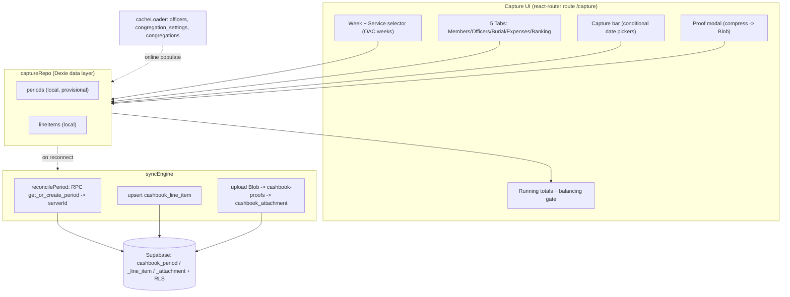
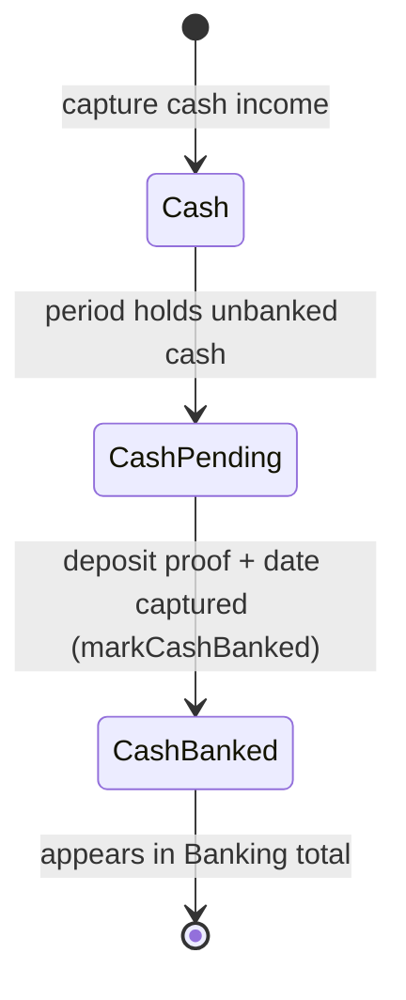
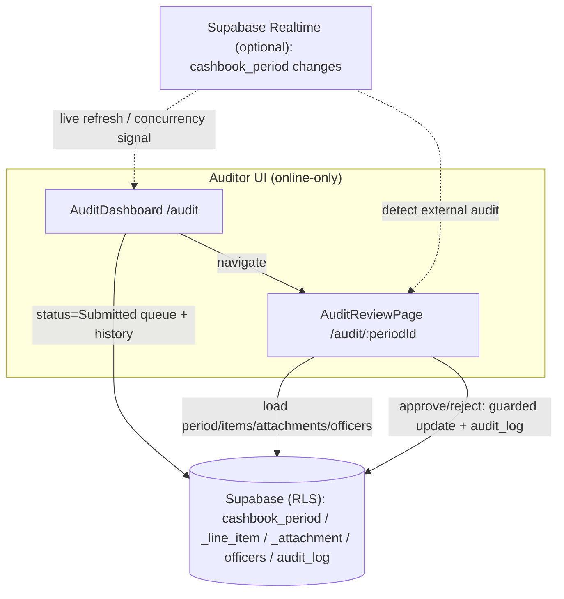
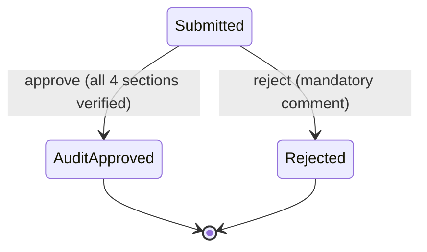
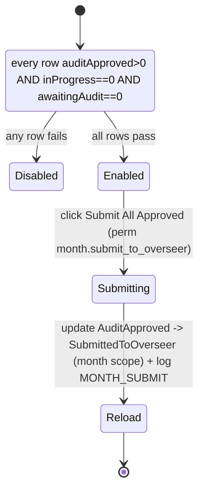

# Design Document ΓÇö Treasurer Capture Flow (Slice 1)

## Overview

This design covers the first restoration slice: the **Treasurer Capture Flow** (Requirements 1 & 2) rebuilt on Vite + React + react-router, operating **offline-first** through Dexie and reconciling to the **real** Supabase schema (`cashbook_period`, `cashbook_line_item`, `cashbook_attachment`, `cashbook-proofs`). It reuses the existing infrastructure (`authService`, `syncEngine`, `statusFlow`, `cacheLoader`, permission gate) but **realigns** the Dexie schema, `captureRepo`, and `syncEngine` away from the incorrect `cashbook_service` model introduced during the migration.

The central offline challenge: periods are created server-side via the `get_or_create_period` RPC, which cannot run offline. The design resolves this with **local provisional periods** keyed by a natural key `(congregation_id, week_key, service)`, reconciled to a server period id at sync time.

Scope is Treasurer capture only. Other roles are later slices.

## Historical grounding (from f6145ff1)

Real tables and rules extracted from the historical capture pages:
- `cashbook_period(id, congregation_id, year, month, week, service, status, week_key, submitted_at)` via RPC `get_or_create_period(p_congregation_id, p_week_key, p_service, p_user_id)`.
- `cashbook_line_item(id, period_id, section, officer_id, is_officer, item_type, payment_type, amount, item_count, receipt_number, manual_reference, transaction_date, proof_status, proof_reference)`.
- `cashbook_attachment(id, line_item_id, file_url, transaction_date, bank_reference, congregation_id, uploaded_by)`.
- `officers(id, officer_code, first_name, last_name, rank, congregation_id, is_active)` ΓÇö capture picker filters `is_active` and `rank IN (Priest, Underdeacon)`.
- `congregation_settings(congregation_id, proof_mandatory)`.
- Storage bucket `cashbook-proofs`, path `{congId}/{year}/{month}/{service}_{week_key}/{userId}/{ts}-proof.ext`.
- Statuses: editable when `Draft` or `Rejected`; submit → `Submitted` (+`submitted_at`).

## Architecture



Offline reads/writes never touch the network; the Sync_Engine performs all Supabase I/O on reconnect.

## Data Models ΓÇö Dexie realignment (schema v2)

The Dexie database `oac_cashbook_local` is bumped to **version 2**. The migration replaces the `captureQueue`/`cashbook_service`-shaped store with period/line-item/attachment stores mirroring the real schema. (Local dev data in v1 is dropped in the upgrade; there is no production offline data yet.)

```
version(2).stores({
  credentials:        "userId",
  congregations:      "id, district_id, overseership_id",
  hierarchyLevels:    "id, parent_id, level_type",
  officers:           "id, congregation_id, rank",
  congregationSettings: "congregation_id",
  periods:            "localId, &naturalKey, serverId, localStatus, congregationId, weekKey",
  lineItems:          "localId, periodLocalId, section, serverId, localStatus",
  syncMeta:           "key",
})
```

Record types:

```
LocalPeriod {
  localId: string          // client UUID (pk)
  naturalKey: string       // `${congregationId}|${weekKey}|${service}` (unique) ΓÇö offline dedup
  serverId: string | null  // cashbook_period.id once reconciled
  congregationId: string
  year: number; month: number; week: number
  weekKey: string          // YYYY-MM-Wn
  service: "AM" | "PM"
  status: ServiceStatus    // Draft/Rejected editable; Submitted locks
  submittedAt: string | null
  capturedByUserId: string
  localStatus: "pending" | "syncing" | "synced" | "conflict" | "failed"
  createdAt: string; updatedAt: string; syncAttempts: number; lastError: string | null
}

LocalLineItem {
  localId: string          // pk
  periodLocalId: string    // FK -> LocalPeriod.localId
  serverId: string | null  // cashbook_line_item.id once synced
  section: LineSection     // Members|Officers|Burial|Expenses
  is_officer: boolean
  item_type: ItemType      // EFT|DirectDebit|Cash|CashPending|CashBanked|Burial|Expense
  payment_type: string | null
  officer_id: string | null
  amount: number
  item_count: number | null
  receipt_number: string | null   // Burial
  manual_reference: string | null // Expense description
  transaction_date: string | null
  proof_status: "uploaded" | null
  proof_reference: string | null   // EFT/DD bank ref
  // offline proof (attachment mapped at sync)
  proofBlob: Blob | null
  proofFileName: string | null
  proofBankRef: string | null
  proofDate: string | null
  localStatus: "pending" | "syncing" | "synced" | "conflict" | "failed"
}
```

At sync, a `LocalLineItem` with a `proofBlob` produces (a) a Storage upload to `cashbook-proofs`, (b) a `cashbook_attachment` row, and (c) `proof_status='uploaded'` on the line item. No separate local attachments store is needed.

## Components and Interfaces

### OAC week utility ΓÇö `src/lib/oacWeeks.ts`
- `getOacWeeks(year, month): OacWeek[]` ΓÇö Week 1 = 2nd Sunday; final week = 1st Sunday of next month; label `Mon YYYY - Week n [DD Mon]`; `weekKey = YYYY-MM-Wn`.
- `getCurrentOacWeek(now?): { year, month, weekKey }`.
Pure functions (property-tested).

### captureRepo (realigned) ΓÇö `src/db/captureRepo.ts`
- `getOrCreateLocalPeriod({ congregationId, weekKey, service, year, month, week, userId }): Promise<LocalPeriod>` ΓÇö dedups on `naturalKey`; creates provisional `status='Draft'` if absent.
- `listOfficers(congregationId)` ΓÇö active, rank Γêê {Priest, Underdeacon}.
- `getProofMandatory(congregationId)` ΓÇö from cached `congregationSettings`, default false.
- `addLineItem(periodLocalId, section, input)` / `updateLineItem` / `deleteLineItem` / `getLineItems(periodLocalId)`.
- `setIncomeType(localId, type)` ΓÇö switching to Cash clears `item_count`, proof fields.
- `attachProof(localId, blob, fileName, { date, bankRef })` ΓÇö stores compressed Blob + metadata, sets item to await upload.
- `markCashBanked(localId, blob, fileName, { date, bankRef })` — Cash/CashPending → CashBanked with deposit proof.
- `setPeriodStatus(periodLocalId, status)` / `submitPeriod(periodLocalId)`.

### Totals & balancing ΓÇö `src/lib/captureTotals.ts` (pure)
- `sectionTotals(items)`, `bankingView(items)`, `isBalanced(items)` where Total Income (Members+Officers+Burial) === Banked + Expenses.
- `monthlyExpensesExceedThreshold(items, 500)`.

### Image compression ΓÇö `src/lib/imageCompress.ts`
- `compressImage(file, maxWidth=1920, quality=0.8): Promise<Blob>` ΓÇö canvas resize/encode; skips non-images and files < 500KB. Ported from historical code (no deps).

### syncEngine (realigned) ΓÇö `src/utils/syncEngine.ts`
- `syncPending()` iterates pending periods ordered by `createdAt`:
  1. `reconcilePeriod`: call `supabase.rpc('get_or_create_period', {...})` → obtain `serverId`; store on LocalPeriod.
  2. Conflict: if server period status is downstream of local (e.g. already Submitted/Approved), mark `conflict`, write audit record, do not overwrite.
  3. For each line item: upsert to `cashbook_line_item` with `period_id = serverId`; if `proofBlob`, upload to `cashbook-proofs`, insert `cashbook_attachment`, set `proof_status='uploaded'`, clear the Blob.
  4. If local status is `Submitted`, apply the `Draft/Rejected → Submitted` transition via `statusFlow.isValidTransition`.
  5. Mark synced / retain failed with exponential backoff.

### UI ΓÇö `src/capture/CapturePage.tsx` + `src/components/CashbookForm.tsx`
- CapturePage: resolves access + congregation, renders week/service selectors, calls `getOrCreateLocalPeriod`, passes to CashbookForm; shows status badge + submitted lock.
- CashbookForm: 5 tabs, per-tab isolated form state, conditional date pickers, proof modal, running totals cards, Banking computed view, officer grouping, submit button gated on `isBalanced` and (if >R500) requestor+Elder comments.

## Cash Lifecycle



## Conditional transaction-date rules (per item type)

| Item type | Date rule | Proof |
| --- | --- | --- |
| EFT / DirectDebit | user-entered date required (+ optional bank ref) | required if proof_mandatory |
| Burial | forced to today | required |
| Expense | user-picked, default today | required |
| Cash | today | none (until banked) |

## Period reconciliation (offline → online)

```mermaid
sequenceDiagram
  participant UI
  participant Dexie
  participant Sync
  participant DB as Supabase
  UI->>Dexie: getOrCreateLocalPeriod(naturalKey) [offline OK]
  UI->>Dexie: add/edit line items, attach proof Blobs
  Note over Sync: connectivity restored
  Sync->>DB: rpc get_or_create_period(cong, weekKey, service, user)
  DB-->>Sync: server period {id, status}
  alt server status downstream of local
    Sync->>Dexie: mark conflict + audit (no overwrite)
  else ok
    Sync->>DB: upsert line items (period_id = server id)
    Sync->>DB: upload proof Blobs -> cashbook-proofs
    Sync->>DB: insert cashbook_attachment; set proof_status
    Sync->>Dexie: store serverIds, mark synced
  end
```

## Error Handling

- Offline period create failure (quota) → surface inline; retain local.
- Submit blocked when unbalanced → show the imbalance (Income vs Banked+Expenses) and the offending totals.
- Submit blocked when expenses > R500 without both comments → prompt for requestor + Elder comment.
- Proof upload failure at sync → keep Blob, retry with backoff; line item stays `pending`.
- RPC/period conflict → mark `conflict`, present a reconciliation notice; never overwrite server state.
- Missing congregation context → instruct the user to connect once online (cacheLoader populates officers/settings).

## Correctness Properties (for property-based tests)

1. **OAC week 1 is the 2nd Sunday**; final week is the 1st Sunday of next month ΓÇö for any year/month. *(Req 1.2)*
2. **Cash proof rule**: an item is `Cash` Γçö `proof_status` is NULL and `item_count` is NULL. *(Req 1.5, 1.8)*
3. **Balancing**: `isBalanced` is true Γçö Members+Officers+Burial === Banked + Expenses. *(Req 1.14)*
4. **Submit gate**: `submitPeriod` succeeds only when balanced and (expenses Γëñ 500 OR both comments present). *(Req 1.14, 1.15)*
5. **Cash lifecycle**: `markCashBanked` moves Cash/CashPending → CashBanked and never the reverse. *(Req 1.10)*
6. **Editability**: mutations are accepted only when period status Γêê {Draft, Rejected}. *(Req 1.13)*
7. **Sync period identity**: reconciliation maps every local line item to the single server `period_id` returned by the RPC; no line item is orphaned. *(Req 1.18, 2.2)*
8. **Permission authority**: capture/edit/submit decisions equal `hasPermission(role, "capture.*")`. *(Req 1.19)*

## Testing Strategy

- **Property-based** (fast-check, ≥100 runs, tagged `Feature: restore-to-vite, Property {n}`) for the pure logic: `getOacWeeks`, `isBalanced`, cash-rule invariants, submit gate, cash lifecycle, editability.
- **Unit** for `captureRepo` mutations (income-type switch clears count/proof; attachProof stores Blob), `imageCompress` (skips small/non-image), and `statusFlow` transitions.
- **Integration/smoke** (representative examples, not PBT): offline capture → reconnect → `get_or_create_period` reconciliation → line items + attachment upserts; Banking computed view totals; submit lock.
- **Regression**: permission-matrix authority; offline operability; proofs to `cashbook-proofs`; data model uses `cashbook_period`.

## Files changed / added

- Change: `src/db/schema.ts` (v2 stores), `src/db/captureRepo.ts` (period model), `src/utils/syncEngine.ts` (RPC reconciliation + attachments), `src/components/CashbookForm.tsx` (5 tabs + dates + proof modal), `src/capture/CapturePage.tsx` (week/service selectors + submit).
- Add: `src/lib/oacWeeks.ts`, `src/lib/captureTotals.ts`, `src/lib/imageCompress.ts`, and a proof modal component.
- `cacheLoader.ts`: also cache `congregation_settings` and officers (rank filter).


---

# Design Document — Auditor Review (Slice 2)

## Overview

The Auditor slice is **online-only** and materially simpler than Treasurer capture: no Dexie, no sync engine, no offline path. The auditor reads live from Supabase (`cashbook_period`, `cashbook_line_item`, `cashbook_attachment`, `officers`) under RLS and writes audit decisions directly to `cashbook_period`. Grounded in the recovered `f6145ff1` pages (`audit/page.tsx`, `audit/[service_id]/page.tsx`).

Two screens:
- **AuditDashboard** (`/audit`) — pending queue + recent history for the auditor's congregation.
- **AuditReviewPage** (`/audit/:periodId`) — sectioned detail with proof viewers, a 4-section verification checklist, and approve/reject.

## Architecture



All access decisions go through `permissions.ts`. Both screens gate on `audit.view_queue`; the decision panel gates on `audit.approve` / `audit.reject`. Online-only: if offline, the audit routes show an offline-unavailable state (consistent with admin/review).

## Components and Interfaces

- `src/audit/AuditDashboard.tsx` — loads congregation + pending (`status="Submitted"`) + history (`status IN ("AuditApproved","Rejected")`, limit 10); renders count banner and two lists; links to `/audit/:periodId`.
- `src/audit/AuditReviewPage.tsx` — loads period + line items + attachments + officers; renders Banking / Cash Pending / Burial / Expenses sections, summary cards, grand total; hosts the Audit Decision panel.
- `src/audit/ProofLink.tsx` — the paperclip proof indicator (green link when an attachment exists, red when missing). Extracted from the historical inline `Clip`.
- Reuse where possible: `captureTotals` (`bankingView`, `sectionTotals`, `expensesTotal`) for section sums so auditor and capture compute identically. Auditor reads server rows (shape-compatible with `CaptureItem`: `section`, `item_type`, `amount`, `proof_status`, `item_count`).

### Data contracts (reads)
- `cashbook_period`: `id, congregation_id, year, month, week, service, status, week_key, submitted_at, audit_comment`.
- `cashbook_line_item`: `id, period_id, section, officer_id, is_officer, item_type, amount, receipt_number, manual_reference, transaction_date`.
- `cashbook_attachment`: `id, line_item_id, file_url, transaction_date, bank_reference`.
- `officers`: `id, officer_code` (identity masked to code only).

### Data contracts (writes)
- Approve: `update cashbook_period set status="AuditApproved", audit_comment=<comment|"Approved"> where id=? and status="Submitted"` + `audit_log` `AUDIT_APPROVE`.
- Reject: `update cashbook_period set status="Rejected", audit_comment=<comment> where id=? and status="Submitted"` + `audit_log` `AUDIT_REJECT`.
- Override (Elder/Chairperson via `O`): `logSelfReviewException({ entityType:"cashbook_period", entityId, assumedRole:"Auditor" })` before the write.

## State machine



Decision panel renders only while `status = "Submitted"`. Approve disabled until all 4 "Verified" checkboxes are checked; Reject disabled until a non-empty comment.

## Concurrency & real-time (row locking)

The original loaded once and wrote unconditionally. This design adds two guards (an enhancement over f6145ff1, called out as such):

1. **Optimistic concurrency lock**: the approve/reject update is conditioned on `status = "Submitted"` (`.eq("id", id).eq("status", "Submitted")`). If the update affects **0 rows**, another auditor already actioned it — the UI shows "This period was already audited" and reloads. This is the "row lock" — it prevents a stale second decision from overwriting the first.
2. **Optional Supabase Realtime**: subscribe to `cashbook_period` changes for the congregation. On the dashboard it live-refreshes the pending count/list; on the review screen, if the open period changes status externally, the decision panel disables and prompts a reload. Realtime is optional (behind availability); the optimistic lock is the authoritative safeguard and works without it.

## Edge Functions

**None required.** Audit status changes are direct, RLS-gated client writes to `cashbook_period` (exactly as the original). The auditor is a congregation-scoped role, not an HO-admin privileged operation, so it does not use the service-role `admin-write` gate. No new Deno functions are added for this slice.

## Routing

- Replace the `/audit` role-dashboard placeholder with `AuditDashboard`.
- Add `/audit/:periodId` → `AuditReviewPage`.
- Both wrapped by the authenticated guard; in-page permission checks (`audit.view_queue`, `audit.approve`, `audit.reject`) match the historical behavior. Historically reachable by Auditor, Chairperson, Elder, HO (with override auditing for Elder/Chairperson).

## Error Handling

- No access / wrong role → "Access denied. Auditor role required."
- Period not found → "Period not found."
- Approve without all 4 verifications → button disabled (guard) + hint.
- Reject without comment → button disabled + "Comment required to reject."
- Concurrency (0 rows updated) → "Already audited" notice + reload.
- Write error → inline error message; no navigation.
- Offline → offline-unavailable state (online-only screen).

## Testing Strategy

- **Unit**: section total helpers reused from `captureTotals` (already property-tested); masked-officer mapping; the `allChecked` gate; reject-requires-comment gate.
- **Integration/smoke** (representative, live-ish): pending-queue query filters to `status="Submitted"`; approve transitions Submitted→AuditApproved with audit_log; reject requires comment and transitions Submitted→Rejected; concurrency guard (second decision on an already-audited period affects 0 rows).
- Mostly manual runtime verification against Supabase, since this slice is live-data and has no offline/pure-logic surface beyond totals.

## Files changed / added

- Add: `src/audit/AuditDashboard.tsx`, `src/audit/AuditReviewPage.tsx`, `src/audit/ProofLink.tsx`.
- Change: `src/App.tsx` (replace `/audit` placeholder + add `/audit/:periodId`).
- Reuse: `src/lib/captureTotals.ts`, `src/lib/permissions.ts` (`logAuditAction`, `logSelfReviewException`, `isOverrideAction`).
- No schema, Dexie, syncEngine, or Edge Function changes.

---

# Design Document — Elder Portal (Slice 3)

## Overview

The Elder slice is **online-only** (like the Auditor): no Dexie, no sync engine, no offline path. The Elder reads live from Supabase across **one or more congregations** and performs exactly one write — advancing audit-approved weeks to `SubmittedToOverseer` (submitting up to the Overseer, who is accountable at HO). All editing and auditing is delegated to the existing `/capture/:periodId` and `/audit/:periodId` screens via the Elder's Override (`O`) permissions, so the Elder Portal itself is a read/aggregate + single-batch-submit dashboard. Grounded in the recovered `f6145ff1` `elder/page.tsx` (617 lines).

One screen, three tabs:
- **Governance** (`/elder`) — per-congregation status counts, a week-drill Review panel that routes into `/capture/:periodId`, an expandable Submission Summary, and the "Submit All Approved to Overseer" batch action.
- **Tithing Review** — per-congregation/per-priest cash-vs-deposit breakdown, % splits, and a top-3 cash-risk highlight.
- **Risk & Audit** — recent `audit_log` events for the month's periods with actor roles, falling back to status-transition rows.

Scope is the Elder dashboard only. The Chairperson governance dashboard is a later slice that reuses this slice's override wiring.

## Historical grounding (from f6145ff1)

- Multi-congregation resolution: `user_congregation_assignments` (active) → `congregations`; fallback `congregations.eldership_id = access.hierarchy_id`.
- Month selector blocks future months; defaults to current `YYYY-MM`.
- OAC weeks per month = (count of Sundays) − 1, min 1 (Week 1 = 2nd Sunday).
- Governance counts map period `status` → In Progress (`Draft|Rejected`), Awaiting Audit (`Submitted`), Audit Approved (`AuditApproved`), Submitted to Overseer (`SubmittedToOverseer` and beyond: `OverseerApproved|OverseerRejected|SubmittedToHO|HOReviewed`).
- Money classification by `is_officer` + `item_type`: cash = `Cash|CashBanked|CashPending`, deposit = `EFT|DirectDebit`; plus `Burial`, `Expense`.
- Review panel routed weeks to `/capture/${periodId}`.
- Button gated on every row `auditApproved>0 && inProgress===0 && awaitingAudit===0`.

### Submission target — corrected against f6145ff1 (Elder → Overseer, not HO)

The restore point contains **two conflicting submit patterns**, verified by `git grep` across `f6145ff1`:

| Source | On submit | Verdict |
| --- | --- | --- |
| `monthly-close/page.tsx` | `cashbook_period.status = "SubmittedToOverseer"`, logs `MONTH_SUBMIT`, gated on `month.submit_to_overseer` + all `AuditApproved` | **Authoritative** — matches `SERVICE_STATUSES` |
| `elder/page.tsx` `handleSubmitAll` | `status = "SubmittedToHO"`, no audit log | **Bug** — skips the Overseer stage |
| `chairperson/page.tsx` | `status = "SubmittedToHO"` | **Same bug** (flag for the Chairperson slice) |

Canonical flow (`SERVICE_STATUSES`, types.ts + schema.sql CHECK): `AuditApproved → SubmittedToOverseer → OverseerApproved/OverseerRejected → SubmittedToHO → HOReviewed`. The **Elder is subordinate to the Overseer** and submits only up to the Overseer; the **Overseer** — accountable at HO and consolidating multiple congregations — is the one who advances `SubmittedToHO`. This slice therefore adopts the `monthly-close` contract: the Elder submit writes **`SubmittedToOverseer`** and logs `MONTH_SUBMIT`. (Note: `monthly-close` read the legacy `cashbook_service` table; this slice standardizes on `cashbook_period`, consistent with Requirement 2. The Overseer/review UI did not exist at `f6145ff1` and is a later slice — Requirement 7.)
- Risk & Audit read `audit_log` (`entity_id IN periodIds`, limit 20) joined to `user_hierarchy_access` roles; fallback to non-Draft status transitions.

## Architecture

```mermaid
flowchart TD
  A[ElderDashboard /elder] -->|getUserAccess + permissions| B{online?}
  B -- no --> OFF[Offline-unavailable state]
  B -- yes --> C[Resolve congregations]
  C -->|user_congregation_assignments active| D[congregations]
  C -.fallback eldership_id.-> D
  D --> E[Load cashbook_period for month]
  E --> F[Load cashbook_line_item + officers]
  F --> G1[Tab: Governance rows + Submission Summary]
  F --> G2[Tab: Tithing Review + Cash Risk]
  E --> G3[Tab: Risk & Audit -> audit_log + roles]
  G1 -->|Review week| CAP[/capture/:periodId (existing)]
  G1 -->|Submit All Approved| SUB[update period status=SubmittedToOverseer + log MONTH_SUBMIT]
  G1 -.override audit.-> AUD[/audit/:periodId (existing)]
```

All access decisions go through `permissions.ts`. Editing/auditing is not reimplemented — the Review panel and any audit action navigate into the existing capture/audit routes, where the established override mechanism logs `SELF_REVIEW_EXCEPTION`.

## Direct-to-Supabase query contracts (month-end aggregation)

All reads are RLS-gated client calls; no Edge Function. Given `selectedMonth = "YYYY-MM"` split into `year`, `month`, and the current user id:

1. **Congregations (primary)**
   - `user_congregation_assignments`: `select congregation_id where user_id = uid and status = 'active'`.
   - `congregations`: `select id, name, code where id in (congIds) order by name`.
2. **Congregations (fallback, when primary is empty)**
   - `congregations`: `select id, name, code where eldership_id = access.hierarchy_id`.
3. **Periods (month scope)**
   - `cashbook_period`: `select id, congregation_id, week, service, status, created_at where congregation_id in (congIds) and year = :year and month = :month`.
4. **Line items**
   - `cashbook_line_item`: `select id, period_id, section, is_officer, item_type, amount, officer_id, proof_status where period_id in (periodIds)`.
   - Guard: if `periodIds` is empty, skip the query (treat as `[]`).
5. **Officers**
   - `officers`: `select id, officer_code, congregation_id where congregation_id in (congIds) and is_active = true`.
6. **Audit log (Tab 3)**
   - `audit_log`: `select user_id, action_type, entity_id, comment, created_at where entity_id in (periodIds) order by created_at desc limit 20`.
   - `user_hierarchy_access`: `select user_id, role where user_id in (actorIds) and status = 'active'` → role lookup map.
7. **Review drill (on demand)**
   - `cashbook_period`: `select id, week, service, status where congregation_id = :congId and year = :year and month = :month order by week`.
8. **Submit all (the only write)** — gated on `hasPermission(role, 'month.submit_to_overseer')`
   - `cashbook_period update { status: 'SubmittedToOverseer' } where congregation_id in (congIds) and year = :year and month = :month and status = 'AuditApproved'`.
   - Then `logAuditAction({ actionType: 'MONTH_SUBMIT', entityType: 'monthly_close', entityId: '{congId}_{year}_{month}', comment: 'Month {year}/{month} submitted to Overseer' })` per submitted congregation-month.
   - **Never** writes `SubmittedToHO` / `OverseerApproved` / `HOReviewed` (those are Overseer/HO responsibilities).

## Aggregation math

Pure, in-memory reductions over the loaded line items (no extra round-trips). Where the same cash/deposit classification already exists in `captureTotals.ts`, reuse those predicates rather than redefining item-type sets.

- **Per-congregation governance row**: filter periods by `congregation_id`; count by status bucket; `capturedWeeks = distinct(period.week)`; `totalWeeks = oacWeekCount(year, month)`; money sums via the cash/deposit/burial/expense classifier split by `is_officer`.
- **Submission Summary total** per congregation: `(membersCash + membersDeposit + officersCash + officersDeposit + burial) − expenses`; expand to per-week rows, and for each captured week render per-service (AM/PM) member/officer/burial/expense sums; show "Not Captured" placeholder for missing weeks `1..totalWeeks`.
- **Tithing Review**: per officer, split members vs officers by `is_officer`, each into cash vs deposit; `priestTotal = membersCash + membersDeposit`, `officerTotal = officersCash + officersDeposit`; congregation subtotals; `% split` against congregation total and eldership total.
- **Cash Risk**: officers with positive cash, sorted by `(membersCash + officersCash)` desc, top 3; `pct = amount / eldershipTotal`, `cashPct = amount / totalCash`.

## Submit-to-Overseer flow (state machine)



- The Elder advances `AuditApproved → SubmittedToOverseer` only. The **Overseer** later advances `SubmittedToOverseer → OverseerApproved → SubmittedToHO`; the Elder never writes those states.
- The write is intentionally narrow: only `AuditApproved` rows in the selected month advance; in-progress/awaiting rows are untouched (the gate already blocks submit while any exist).
- The batch update is idempotent under re-click (already-advanced rows no longer match `status = 'AuditApproved'`).
- No optimistic-lock `.select()` count is required here (unlike the Auditor single-row action); the operation is a scoped batch and re-running is harmless. This is called out as a deliberate difference from the Auditor slice.

## Navigation into existing capture & audit (override)

- Review panel week rows → `router.push('/capture/:periodId')` (unchanged from f6145ff1).
- Where the Elder audits rather than edits, the same navigation targets `/audit/:periodId`, which already renders the Auditor decision panel and, for a non-Auditor role acting via `O`, calls `logSelfReviewException({ entityType:'cashbook_period', entityId, assumedRole:'Auditor' })` before the write (defined in the Auditor slice).
- The Elder Portal adds **no** new override-logging code; it relies on the capture/audit screens as the single enforcement point. `/capture`, `/audit`, and `/elder` are all reachable by the Elder per the existing route map.

## Routing

- Replace the `/elder` role-dashboard placeholder with `ElderDashboard`.
- Reuse existing `/capture/:periodId` and `/audit/:periodId` (no new routes for this slice).
- Wrapped by the authenticated guard; in-page permission checks derive from `permissions.ts`.

## Error Handling

- No access / not resolvable → load nothing, render empty/loading terminal state.
- No congregations → empty state, no period queries.
- Future month selected → "Cannot select future period" toast; selection unchanged.
- Empty `periodIds` → skip line-item/audit queries (no malformed `in ()` calls).
- Offline → offline-unavailable state (online-only screen).
- Submit failure → surface inline; do not optimistically flip local counts (reload reflects true state).

## Testing Strategy

- **Unit**: OAC week-count helper (reuse `oacWeeks`); governance status-bucketing; cash/deposit classification reused from `captureTotals`; submit-gate predicate (`every(auditApproved>0 && inProgress==0 && awaitingAudit==0)`); cash-risk top-3 ordering and percentage math.
- **Integration/smoke** (live-ish): congregation resolution primary vs eldership fallback; month scope filters periods; submit advances only `AuditApproved` rows to `SubmittedToOverseer` and logs `MONTH_SUBMIT`; audit-log tab falls back to status transitions when empty.
- Mostly manual runtime verification against Supabase (live-data slice; pure-logic surface is the aggregation/gate helpers).

## Files changed / added

- Add: `src/elder/ElderDashboard.tsx` (three tabs, review panel, submission summary, submit-all).
- Change: `src/App.tsx` (replace `/elder` placeholder).
- Reuse: `src/lib/permissions.ts`, `src/lib/oacWeeks.ts`, `src/lib/captureTotals.ts` (classification predicates), and the existing `/capture` + `/audit` screens (override + `SELF_REVIEW_EXCEPTION` logging).
- No schema, Dexie, syncEngine, or Edge Function changes. **No Treasurer/offline files touched.**
