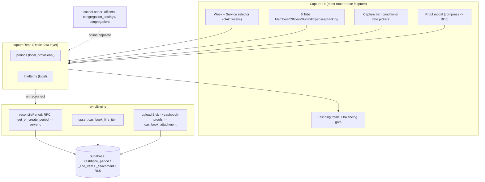
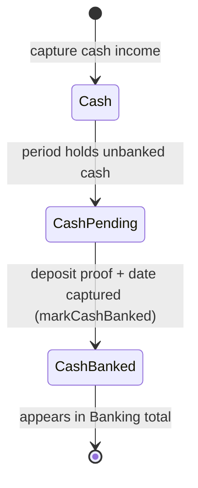

# Design Document — Treasurer Capture Flow (Slice 1)

## Overview

This design covers the first restoration slice: the **Treasurer Capture Flow** (Requirements 1 & 2) rebuilt on Vite + React + react-router, operating **offline-first** through Dexie and reconciling to the **real** Supabase schema (`cashbook_period`, `cashbook_line_item`, `cashbook_attachment`, `cashbook-proofs`). It reuses the existing infrastructure (`authService`, `syncEngine`, `statusFlow`, `cacheLoader`, permission gate) but **realigns** the Dexie schema, `captureRepo`, and `syncEngine` away from the incorrect `cashbook_service` model introduced during the migration.

The central offline challenge: periods are created server-side via the `get_or_create_period` RPC, which cannot run offline. The design resolves this with **local provisional periods** keyed by a natural key `(congregation_id, week_key, service)`, reconciled to a server period id at sync time.

Scope is Treasurer capture only. Other roles are later slices.

## Historical grounding (from f6145ff1)

Real tables and rules extracted from the historical capture pages:
- `cashbook_period(id, congregation_id, year, month, week, service, status, week_key, submitted_at)` via RPC `get_or_create_period(p_congregation_id, p_week_key, p_service, p_user_id)`.
- `cashbook_line_item(id, period_id, section, officer_id, is_officer, item_type, payment_type, amount, item_count, receipt_number, manual_reference, transaction_date, proof_status, proof_reference)`.
- `cashbook_attachment(id, line_item_id, file_url, transaction_date, bank_reference, congregation_id, uploaded_by)`.
- `officers(id, officer_code, first_name, last_name, rank, congregation_id, is_active)` — capture picker filters `is_active` and `rank IN (Priest, Underdeacon)`.
- `congregation_settings(congregation_id, proof_mandatory)`.
- Storage bucket `cashbook-proofs`, path `{congId}/{year}/{month}/{service}_{week_key}/{userId}/{ts}-proof.ext`.
- Statuses: editable when `Draft` or `Rejected`; submit → `Submitted` (+`submitted_at`).

## Architecture



Offline reads/writes never touch the network; the Sync_Engine performs all Supabase I/O on reconnect.

## Data Models — Dexie realignment (schema v2)

The Dexie database `oac_cashbook_local` is bumped to **version 2**. The migration replaces the `captureQueue`/`cashbook_service`-shaped store with period/line-item/attachment stores mirroring the real schema. (Local dev data in v1 is dropped in the upgrade; there is no production offline data yet.)

```
version(2).stores({
  credentials:        "userId",
  congregations:      "id, district_id, overseership_id",
  hierarchyLevels:    "id, parent_id, level_type",
  officers:           "id, congregation_id, rank",
  congregationSettings: "congregation_id",
  periods:            "localId, &naturalKey, serverId, localStatus, congregationId, weekKey",
  lineItems:          "localId, periodLocalId, section, serverId, localStatus",
  syncMeta:           "key",
})
```

Record types:

```
LocalPeriod {
  localId: string          // client UUID (pk)
  naturalKey: string       // `${congregationId}|${weekKey}|${service}` (unique) — offline dedup
  serverId: string | null  // cashbook_period.id once reconciled
  congregationId: string
  year: number; month: number; week: number
  weekKey: string          // YYYY-MM-Wn
  service: "AM" | "PM"
  status: ServiceStatus    // Draft/Rejected editable; Submitted locks
  submittedAt: string | null
  capturedByUserId: string
  localStatus: "pending" | "syncing" | "synced" | "conflict" | "failed"
  createdAt: string; updatedAt: string; syncAttempts: number; lastError: string | null
}

LocalLineItem {
  localId: string          // pk
  periodLocalId: string    // FK -> LocalPeriod.localId
  serverId: string | null  // cashbook_line_item.id once synced
  section: LineSection     // Members|Officers|Burial|Expenses
  is_officer: boolean
  item_type: ItemType      // EFT|DirectDebit|Cash|CashPending|CashBanked|Burial|Expense
  payment_type: string | null
  officer_id: string | null
  amount: number
  item_count: number | null
  receipt_number: string | null   // Burial
  manual_reference: string | null // Expense description
  transaction_date: string | null
  proof_status: "uploaded" | null
  proof_reference: string | null   // EFT/DD bank ref
  // offline proof (attachment mapped at sync)
  proofBlob: Blob | null
  proofFileName: string | null
  proofBankRef: string | null
  proofDate: string | null
  localStatus: "pending" | "syncing" | "synced" | "conflict" | "failed"
}
```

At sync, a `LocalLineItem` with a `proofBlob` produces (a) a Storage upload to `cashbook-proofs`, (b) a `cashbook_attachment` row, and (c) `proof_status='uploaded'` on the line item. No separate local attachments store is needed.

## Components and Interfaces

### OAC week utility — `src/lib/oacWeeks.ts`
- `getOacWeeks(year, month): OacWeek[]` — Week 1 = 2nd Sunday; final week = 1st Sunday of next month; label `Mon YYYY - Week n [DD Mon]`; `weekKey = YYYY-MM-Wn`.
- `getCurrentOacWeek(now?): { year, month, weekKey }`.
Pure functions (property-tested).

### captureRepo (realigned) — `src/db/captureRepo.ts`
- `getOrCreateLocalPeriod({ congregationId, weekKey, service, year, month, week, userId }): Promise<LocalPeriod>` — dedups on `naturalKey`; creates provisional `status='Draft'` if absent.
- `listOfficers(congregationId)` — active, rank ∈ {Priest, Underdeacon}.
- `getProofMandatory(congregationId)` — from cached `congregationSettings`, default false.
- `addLineItem(periodLocalId, section, input)` / `updateLineItem` / `deleteLineItem` / `getLineItems(periodLocalId)`.
- `setIncomeType(localId, type)` — switching to Cash clears `item_count`, proof fields.
- `attachProof(localId, blob, fileName, { date, bankRef })` — stores compressed Blob + metadata, sets item to await upload.
- `markCashBanked(localId, blob, fileName, { date, bankRef })` — Cash/CashPending → CashBanked with deposit proof.
- `setPeriodStatus(periodLocalId, status)` / `submitPeriod(periodLocalId)`.

### Totals & balancing — `src/lib/captureTotals.ts` (pure)
- `sectionTotals(items)`, `bankingView(items)`, `isBalanced(items)` where Total Income (Members+Officers+Burial) === Banked + Expenses.
- `monthlyExpensesExceedThreshold(items, 500)`.

### Image compression — `src/lib/imageCompress.ts`
- `compressImage(file, maxWidth=1920, quality=0.8): Promise<Blob>` — canvas resize/encode; skips non-images and files < 500KB. Ported from historical code (no deps).

### syncEngine (realigned) — `src/utils/syncEngine.ts`
- `syncPending()` iterates pending periods ordered by `createdAt`:
  1. `reconcilePeriod`: call `supabase.rpc('get_or_create_period', {...})` → obtain `serverId`; store on LocalPeriod.
  2. Conflict: if server period status is downstream of local (e.g. already Submitted/Approved), mark `conflict`, write audit record, do not overwrite.
  3. For each line item: upsert to `cashbook_line_item` with `period_id = serverId`; if `proofBlob`, upload to `cashbook-proofs`, insert `cashbook_attachment`, set `proof_status='uploaded'`, clear the Blob.
  4. If local status is `Submitted`, apply the `Draft/Rejected → Submitted` transition via `statusFlow.isValidTransition`.
  5. Mark synced / retain failed with exponential backoff.

### UI — `src/capture/CapturePage.tsx` + `src/components/CashbookForm.tsx`
- CapturePage: resolves access + congregation, renders week/service selectors, calls `getOrCreateLocalPeriod`, passes to CashbookForm; shows status badge + submitted lock.
- CashbookForm: 5 tabs, per-tab isolated form state, conditional date pickers, proof modal, running totals cards, Banking computed view, officer grouping, submit button gated on `isBalanced` and (if >R500) requestor+Elder comments.

## Cash Lifecycle



## Conditional transaction-date rules (per item type)

| Item type | Date rule | Proof |
| --- | --- | --- |
| EFT / DirectDebit | user-entered date required (+ optional bank ref) | required if proof_mandatory |
| Burial | forced to today | required |
| Expense | user-picked, default today | required |
| Cash | today | none (until banked) |

## Period reconciliation (offline → online)

```mermaid
sequenceDiagram
  participant UI
  participant Dexie
  participant Sync
  participant DB as Supabase
  UI->>Dexie: getOrCreateLocalPeriod(naturalKey) [offline OK]
  UI->>Dexie: add/edit line items, attach proof Blobs
  Note over Sync: connectivity restored
  Sync->>DB: rpc get_or_create_period(cong, weekKey, service, user)
  DB-->>Sync: server period {id, status}
  alt server status downstream of local
    Sync->>Dexie: mark conflict + audit (no overwrite)
  else ok
    Sync->>DB: upsert line items (period_id = server id)
    Sync->>DB: upload proof Blobs -> cashbook-proofs
    Sync->>DB: insert cashbook_attachment; set proof_status
    Sync->>Dexie: store serverIds, mark synced
  end
```

## Error Handling

- Offline period create failure (quota) → surface inline; retain local.
- Submit blocked when unbalanced → show the imbalance (Income vs Banked+Expenses) and the offending totals.
- Submit blocked when expenses > R500 without both comments → prompt for requestor + Elder comment.
- Proof upload failure at sync → keep Blob, retry with backoff; line item stays `pending`.
- RPC/period conflict → mark `conflict`, present a reconciliation notice; never overwrite server state.
- Missing congregation context → instruct the user to connect once online (cacheLoader populates officers/settings).

## Correctness Properties (for property-based tests)

1. **OAC week 1 is the 2nd Sunday**; final week is the 1st Sunday of next month — for any year/month. *(Req 1.2)*
2. **Cash proof rule**: an item is `Cash` ⇔ `proof_status` is NULL and `item_count` is NULL. *(Req 1.5, 1.8)*
3. **Balancing**: `isBalanced` is true ⇔ Members+Officers+Burial === Banked + Expenses. *(Req 1.14)*
4. **Submit gate**: `submitPeriod` succeeds only when balanced and (expenses ≤ 500 OR both comments present). *(Req 1.14, 1.15)*
5. **Cash lifecycle**: `markCashBanked` moves Cash/CashPending → CashBanked and never the reverse. *(Req 1.10)*
6. **Editability**: mutations are accepted only when period status ∈ {Draft, Rejected}. *(Req 1.13)*
7. **Sync period identity**: reconciliation maps every local line item to the single server `period_id` returned by the RPC; no line item is orphaned. *(Req 1.18, 2.2)*
8. **Permission authority**: capture/edit/submit decisions equal `hasPermission(role, "capture.*")`. *(Req 1.19)*

## Testing Strategy

- **Property-based** (fast-check, ≥100 runs, tagged `Feature: restore-to-vite, Property {n}`) for the pure logic: `getOacWeeks`, `isBalanced`, cash-rule invariants, submit gate, cash lifecycle, editability.
- **Unit** for `captureRepo` mutations (income-type switch clears count/proof; attachProof stores Blob), `imageCompress` (skips small/non-image), and `statusFlow` transitions.
- **Integration/smoke** (representative examples, not PBT): offline capture → reconnect → `get_or_create_period` reconciliation → line items + attachment upserts; Banking computed view totals; submit lock.
- **Regression**: permission-matrix authority; offline operability; proofs to `cashbook-proofs`; data model uses `cashbook_period`.

## Files changed / added

- Change: `src/db/schema.ts` (v2 stores), `src/db/captureRepo.ts` (period model), `src/utils/syncEngine.ts` (RPC reconciliation + attachments), `src/components/CashbookForm.tsx` (5 tabs + dates + proof modal), `src/capture/CapturePage.tsx` (week/service selectors + submit).
- Add: `src/lib/oacWeeks.ts`, `src/lib/captureTotals.ts`, `src/lib/imageCompress.ts`, and a proof modal component.
- `cacheLoader.ts`: also cache `congregation_settings` and officers (rank filter).
